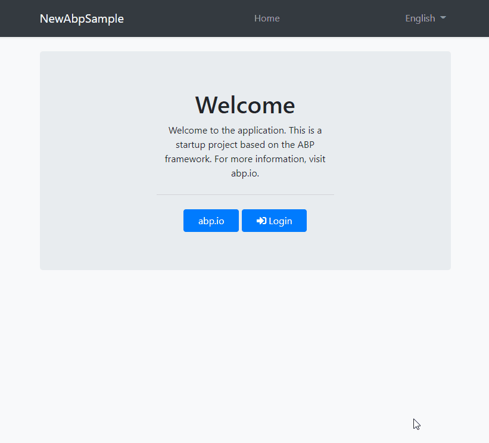

# eHealth Ontario OneID Authentication Middleware

- An easy to use library that makes connecting with eHealth Ontario easy for .NET Kestrel/Owin/Katana applications.

<p align="center">
  <a href="https://dev.azure.com/css/eHealthServices/_build/latest?definitionId=39&branchName=develop">
    
  </a>
</p>

<p align="center">
    <a href="#beginner-about">About</a> |
    <a href="#sunny-usage">Usage</a> |
    <a href="#wrench-development">Development</a> |
    <a href="#camera-gallery">Gallery</a> |
    <a href="#star2-creditacknowledgment">Acknowledgement</a> |
    <a href="#lock-license">License</a>
</p>

---

# :beginner: About
This library was created by Clinical Support Systems and Kori Francis, who have experience integrating with APIs of varying complexity. We wanted to simplify the connection in .NET web applications so we could get on with the actual API implementation.

# :sunny: Usage
Here's how to use this library in your project.

###  :electric_plug: NuGet Installation

```powershell
Install-Package AspNet.Security.OAuth.OneID
```

###  :package: Startup.cs

Add the following to your authentication pipeline:

**OWIN/Katana (ASP.NET)**
```c#
app.UseOneIdAuthentication(new OneIdAuthenticationOptions()
    {
        CertificateThumbprint = ConfigurationManager.AppSettings["EHS:CertificateThumbprint"],
        ClientId = ConfigurationManager.AppSettings["EHS:AuthClientId"],
        Environment = OneIdAuthenticationEnvironment.PartnerSelfTest
    });
```

**Kestrel (ASP.NET Core)**
```c#
services.AddAuthentication().AddOneId(options =>
    {
        options.ClientId = Configuration["EHS:AuthClientId"];
        options.CertificateThumbprint = Configuration["EHS:CertificateThumbprint"];
        options.Environment = OneIdAuthenticationEnvironment.PartnerSelfTest;
    });
```

#  :wrench: Development
If you want other people to contribute to this project, this is the section, make sure you always add this.

### :notebook: Pre-Requisites

List all the pre-requisites the system needs to develop this project.

- You will need a PKI certificate from eHealth Ontario
- You will need login credentials from eHealth Ontario

 ###  :fire: Contribution

 Your contributions are always welcome and appreciated. Following are the things you can do to contribute to this project.

 1. **Report a bug** <br>
 If you think you have encountered a bug, and I should know about it, feel free to report it and I will take care of it.

 2. **Request a feature** <br>
 You can also request for a feature.

 3. **Create a pull request** <br>
 It can't get better then this, your pull request will be appreciated by the community. You can get started by picking up any open issues from [here](https://github.com/Clinical-Support-Systems/oneid-oauth-middleware/issues) and make a pull request.

 > If you are new to open-source, make sure to check read more about it [here](https://www.digitalocean.com/community/tutorial_series/an-introduction-to-open-source) and learn more about creating a pull request [here](https://www.digitalocean.com/community/tutorials/how-to-create-a-pull-request-on-github).


 ### :cactus: Branches

 I use an agile continuous integration methodology, so the version is frequently updated and development is really fast.

1. **`develop`** is the development branch.

2. **`master`** is the production branch.

4. No further branches should be created in the main repository.

**Steps to create a pull request**

1. Make a PR to `master` branch.
2. Comply with the best practices and guidelines e.g. where the PR concerns visual elements it should have an image showing the effect.
3. It must pass all continuous integration checks and get positive reviews.

After this, changes will be merged.

#  :camera: Gallery



# :star2: Credit/Acknowledgment
 * Kori Francis
 * David Ball
 * Alex McKeever

#  :lock: License

[License](https://raw.githubusercontent.com/Clinical-Support-Systems/oneid-oauth-middleware/master/LICENSE)