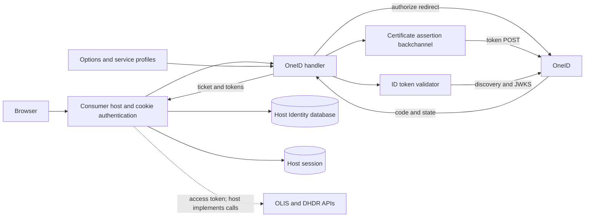
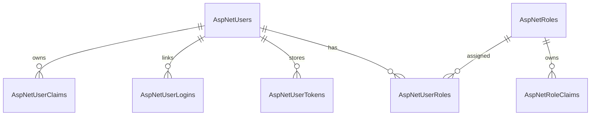

# OneID middleware: codebase knowledge

Analysis date: 2026-09-07. **Production context:** the project owner confirms this project is currently used in production. The deployed package version, target framework, consumer configuration and overrides were not identified. Preserve compatibility and assess findings against that deployment before changing behavior. This document describes the inspected repository, not a certification of live Ontario Health behavior. Source references are repository-root-relative. The source inventory, line counts, SHA-256 prefixes, and stable anchors are in `codebase-analysis-docs/assets/FILE_INDEX.md` and `codebase-analysis-docs/assets/SOURCE_ANCHORS.md`. Phase checkpoints are in `codebase-analysis-docs/assets/STATE_BLOCKS.md`.

## 1. High-Level Overview

### 1.1 Purpose and boundaries

`AspNet.Security.OAuth.OneID` is a .NET authentication adapter for Ontario Health's OneID identity provider/OneID Access Gateway (OAG). It lets a healthcare application authenticate a user and obtain delegated tokens for Ontario health services. Its intended direct users are developers integrating clinical web applications; clinicians are the end users of those applications. It does not implement laboratory or medication queries, patient records, a FHIR server, or clinical authorization policies. `README.md` describes OLIS and DHDR support and explicitly marks DHIR unsupported.

The deployable business application belongs to the consumer. The library produces an authentication ticket and exposes tokens; the consumer owns local accounts, cookies, session storage, downstream API calls, and logout orchestration. No database is required by the library. The two consumer examples use separate ASP.NET Identity stacks and SQL-backed local accounts.

### 1.2 Features and business purposes

| Feature | Business purpose | Implementation and interaction |
|---|---|---|
| OneID external sign-in | Reuse a provisioned healthcare identity | Platform-specific `OneIdAuthenticationHandler` classes redirect to OneID and process authorization-code callbacks. |
| OLIS/DHDR scope and profile selection | Request access for laboratory results, medication dispenses, or both in one login | `OneIdAuthenticationOptions.ServiceProfileOptions` changes scopes; handlers add `_profile` and the clinical API audience. |
| Certificate-signed client authentication | Prove the integrating application's identity to OneID | `OneIdAuthenticationBackChannelHandler` signs a client assertion and injects it into token requests. This is JWT assertion signing; the implementation does not add this certificate to TLS client certificates. |
| ID-token validation | Prevent accepting an untrusted, expired, wrong-client, or replayed identity token | Core uses discovery plus `DefaultOneIdTokenValidator`; Katana has `ValidateIdTokenAsync`. See important limitations in section 3. |
| Claims mapping | Provide standard .NET identity fields to the host | Core extracts selected JWT claims; Katana builds `OneIdAuthenticatedContext` and then a `ClaimsIdentity`. |
| Token persistence and manual refresh | Permit later clinical API access without repeating interactive login | Core saves selected tokens into session and optionally authentication properties. `OneIdHelper.RefreshToken` returns a new access-token string. |
| Extension hooks | Let host applications customize identity/ticket handling | Core OAuth events and validator interface; Katana provider delegates and handler factory. |
| Local account demonstrations | Show how external identity connects to application accounts | Kestrel Razor Pages/Identity and Katana Web Forms/Identity examples. Their account databases are outside the middleware. |
| End-session/revocation helpers | Assist explicit session cleanup | Helpers exist, but README still marks logout/end-session unsupported; implementation is incomplete and inconsistent. |

### 1.3 Repository and stack

| Repository area | Responsibility |
|---|---|
| `src/AspNet.Security.OAuth.OneID/` | Published package; shared options, constants, assertions, helpers, token DTOs, and two authentication handlers. |
| `src/AspNet.Security.OAuth.OneID/Provider/` | Mostly Katana provider contexts and factory; `OneIdAuthenticatedContext` also has a Core variant. |
| `src/ConsumerApp.Kestrel/` | .NET 9 Razor Pages example using ASP.NET Core Identity, EF Core 9.0.2 and SQL Server. Entry: `Program.Main` → `Startup`. |
| `src/ConsumerApp.Katana/` | .NET Framework 4.8 Web Forms example, OWIN/Katana, ASP.NET Identity and Entity Framework. Entry: `Startup` → `ConfigureAuth`; `Global.asax.cs` handles web application startup. |
| `tests/AspNet.Security.OAuth.OneID.Tests/` | .NET 9 xUnit tests, reflection/subclass-based handler tests, HTTP interception fixtures. Project filename retains `OAuth.Providers.Tests`. |
| `tutorial/` | Generated tutorial navigation and six component explanations. Useful orientation, subordinate to executable source. |
| `.github/workflows/`, root configuration | CI/release, SDK selection, NuGet feed, versioning and style. |

The library project targets **both `net48` and `net8.0`**. Its project defines `NETFULL` for Framework and `NETCORE` otherwise; many files also use `NET8_0_OR_GREATER`. These symbols are part of the architecture, not incidental formatting. A new target needs a review of all three conditions.

`global.json` selects SDK **9.0.305**, `latestPatch`, no prereleases. SDK and runtime targets differ. Notable library dependencies: OWIN 4.2.2 on Framework; ASP.NET Core OpenIdConnect 8.0.* on Core, although the actual handler inherits **OAuthHandler**, not OpenIdConnectHandler; IdentityModel packages with `[8.3.1,)` lower-bounded ranges; Newtonsoft.Json 13.0.*; Nerdbank.GitVersioning 3.9.50. These are declared constraints, not a verified resolved dependency graph. `NuGet.Config` uses only the public NuGet v3 feed. `Directory.Build.props` currently contains no effective shared settings.

**Decisions/Findings:** Treat the library, host identity system, and clinical APIs as distinct responsibilities. Preserve both library targets.

**Open Questions:** Provisioned endpoints, certificates and supported live OneID behavior are not established by source inspection.

**Next Steps:** Use section 2 to locate the relevant runtime path before editing.

## 2. Mid-Level Technical Notes

### 2.1 Component architecture



Source: library handlers, backchannel, validator and consumer `Startup` files. This diagram describes intended relationships; Katana's default JWKS path currently conflicts with its backchannel contract.

**Core registration:** `OneIdAuthenticationExtensions.AddOneId` overloads converge on `(builder, scheme, caption, configuration)`. It adds `IHttpClientFactory`, a singleton `JwtSecurityTokenHandler`, and singleton `IPostConfigureOptions<OneIdAuthenticationOptions>`, then `AddOAuth<OneIdAuthenticationOptions, OneIdAuthenticationHandler>`. Runtime parsing uses the options' `JsonWebTokenHandler`; the registered JWT handler singleton is not the parser used by `ExtractClaimsFromToken`.

`OneIdAuthenticationPostConfigureOptions.PostConfigure` fills validation audience from `ClientId` when empty, installs `DefaultOneIdTokenValidator`, creates a discovery `ConfigurationManager<OpenIdConnectConfiguration>` when absent, and initializes `SecurityTokenHandler`. Discovery uses an ordinary factory HTTP client deliberately, because the assertion backchannel requires a form body. Configuration auto-refresh is one day; minimum refresh interval is 30 seconds. There is no explicit retry-on-signing-key-not-found path in the custom validator.

**Katana registration:** `UseOneIdAuthentication` registers `OneIdAuthenticationMiddleware`. Its constructor requires `ClientId`, creates protected state with `PropertiesDataFormat`, resolves the external sign-in authentication type, constructs a shared `HttpClient`, and installs `OneIdAuthenticationHandlerFactory` unless supplied. The default timeout is 60 seconds from options; maximum buffered response is 10 MiB. The factory creates request handlers sharing the client/logger. Middleware disposal disposes the client and underlying handler.

### 2.2 Core sign-in sequence

```mermaid
sequenceDiagram
  participant B as Browser
  participant H as Host/OAuth framework
  participant O as OneID handler
  participant I as OneID
  H->>O: Challenge(properties)
  O->>O: Add nonce before base challenge/state protection
  O-->>B: Redirect with PKCE, state, nonce, profile
  B->>I: Login/authorization
  I-->>B: Redirect with code and state
  B->>H: Callback
  H->>O: ExchangeCodeAsync
  O->>I: Code + verifier + signed client assertion
  I-->>O: Token JSON
  O->>I: Discovery/JWKS through validator
  O->>O: Validate ID token and nonce; map claims
  O-->>H: Ticket; session/property tokens
  H-->>B: Host external sign-in continuation
```

`BuildChallengeUrl` creates 32 random bytes encoded as hexadecimal nonce, stores `oneid_expected_nonce` in authentication properties **before** calling the base implementation, then appends `nonce`, `aud=https://provider.ehealthontario.ca`, and `_profile`. Framework OAuth machinery owns challenge state, correlation, and PKCE generation. `UsePkce` defaults true. `AdditionalParameters` is not read by this override.

`ExchangeCodeAsync` requires `properties.Items["code_verifier"]`; absent key throws even if `UsePkce` was changed to false. It POSTs `redirect_uri`, `grant_type=authorization_code`, `client_id`, `code`, and `code_verifier` to `Options.TokenEndpoint`. The signing backchannel adds assertion fields. No `client_secret` is sent by this method. Non-success status produces `OAuthTokenResponse.Failed(OneIdAuthenticationException)` containing remote headers/body; success parses a `JsonDocument`. Cancellation follows `Context.RequestAborted` for the send.

`CreateTicketAsync` first invokes the token-saving helper, requires a nonblank `id_token`, logs redacted token values at Trace, invokes `Events.ValidateIdToken`, extracts claims, optionally extracts an actor from a JWT-shaped access token, populates session, runs claim actions, raises `CreatingTicket`, and returns the ticket. **There is no user-info HTTP request in this method.** `OAuthCreatingTicketContext.User` receives the token response root, not user-info JSON. Discovery is used for validation; it does not replace the configured authorization/token endpoints.

### 2.3 Validation and claims

Core `DefaultOneIdTokenValidator.ValidateAsync` requires a validating token handler, configuration manager and validation parameters. It loads discovery; if `JsonWebKeySet` is missing, it fetches `JwksUri`, or derives `/connect/jwk_uri` from the discovery authorization endpoint. Nonempty JWKS and discovery issuer are mandatory. It clones options parameters, sets `IssuerSigningKeys`, forces issuer validation against discovery's issuer, validates the token, then requires expected nonce and ordinal equality with its `nonce` claim. Exceptions propagate; logging includes issuer/audience and a redacted token.

`OneIdAuthenticationEvents.ValidateIdToken` delegates to `Options.TokenValidator`. If none is present, its default delegate completes without validation. Normal `AddOneId` post-configuration supplies one; direct handler constructions and custom events can bypass it. `ValidateTokens` is not consulted by this path. `TokenValidationParameters.NameClaimType`/`RoleClaimType` affect the validation result, but the runtime handler maps a separate identity from a fresh parse rather than returning that validated identity wholesale.

| ID-token source claim | Core claim destination | Katana destination |
|---|---|---|
| `sub` | `ClaimTypes.NameIdentifier` and raw `sub` | `ClaimTypes.NameIdentifier` |
| `email` | `ClaimTypes.Email` | `ClaimTypes.Email` |
| `given_name` | `ClaimTypes.GivenName` | `ClaimTypes.GivenName` |
| `family_name` | `ClaimTypes.Name` in extraction; top-level JSON claim action targets `Surname` | `ClaimTypes.Surname` |
| `phoneNumber` | `ClaimTypes.HomePhone` | `ClaimTypes.HomePhone` |
| `username`, then `preferred_username`, `upn`, `unique_name` | First available becomes `ClaimTypes.Actor` | Handler checks `context.UserName`, but its constructor never assigns it. |

Source: `OneIdAuthenticationHandler.NetCore.cs:ExtractClaimsFromToken`, options constructor, `Provider/OneIdAuthenticatedContext.cs`, and Framework handler. Core `original_username` session value uses `principal.Identity.Name`, which may be the family name, not Actor. The custom `OneIdAuthenticationClaimAction` only adds a mapped email if absent and a raw email claim exists. It does not fetch user info.

### 2.4 Environment and service selection

`OneIdAuthenticationOptions.Environment` immediately recomputes authority, audience, authorization, token, claims issuer, end-session, metadata and Core user-info endpoints. Set it before intentional endpoint overrides. Merely setting `Authority` does not recompute other endpoints. Core constructor selects Development; Framework leaves the backing field at PartnerSelfTest. Do not rely on the defaults class's Development constant to describe Framework behavior.

For nonproduction environment prefix `e` (`dev`, `qa`, `pst`), constants define:

| Property | Constructed value |
|---|---|
| Authority | `https://login.{e}.oneidfederation.ehealthontario.ca` |
| AuthorizationEndpoint | authority + `/oidc/authorize` |
| TokenEndpoint | authority + `/oidc/access_token` |
| MetadataEndpoint | authority + `/oidc/.well-known/openid-configuration` |
| EndSessionEndpoint | authority + `/oidc/connect/endSession` |
| ClaimsIssuer | `login.{e}.oneidfederation.ehealthontario.ca` (no scheme) |
| Audience for client assertion | authority + `/sso/oauth2/realms/root/realms/idaas{e}oidc/access_token` |
| Core UserInfo | authority + `/sso/oauth2/realms/root/realms/idaas{e}oidc/userinfo` |

Production removes `.prod` from most endpoint values and changes `idaasprodoidc` to `idaasoidc` for Audience/UserInfo. **Authority is not included in the production replacements**, leaving `login.prod...` there. Core validation ultimately uses the discovery issuer, which reduces but does not remove confusion from this inconsistency. Source: `OneIdAuthenticationConstants.FormatStrings`, `OneIdAuthenticationOptions.UpdateEndpoints`.

Profiles are flags: `None=0`, `OLIS=1`, `DHDR=2`. All use `openid`; OLIS adds `user/DiagnosticReport.read` and profile `http://ehealthontario.ca/StructureDefinition/ca-on-lab-profile-DiagnosticReport`; DHDR adds `user/MedicationDispense.read` and profile `http://ehealthontario.ca/StructureDefinition/ca-on-dhdr-profile-MedicationDispense`. Combined profiles are space-separated, OLIS first. The setter only adds scopes, never removes previously selected service scopes. Reassigning profile flags can leave scope and `_profile` inconsistent; Framework's list can also accumulate duplicates.

Core `Validate()` temporarily substitutes a random secret to call OAuth base validation, restores it, then checks supported profile/token flags, nonproduction `ClientSecret`, callback, endpoints and configuration manager. The temporary secret restoration is not in `finally`; a base validation exception can leave the placeholder assigned. The nonproduction secret requirement is configuration policy even though the token POST uses a certificate assertion. Default service flags are None and therefore need explicit configuration.

### 2.5 Assertion backchannel and certificate lifecycle

`OneIdAuthenticationBackChannelHandler.SendAsync` rejects null requests or missing content, loads a certificate, and creates an RS256 JWT with `iss=sub=ClientId`, `aud=Options.Audience`, integer `iat`/`exp`, a 20-minute validity window, and random GUID `jti`. It removes the generated `kid` header because the code records OneID rejecting it. It parses form data with URL decoding, overwrites `client_assertion_type`, `client_assertion`, and form `aud` (the clinical API audience), re-encodes once, then calls the base HTTP handler. Duplicate form keys collapse to the last value; empty keys are dropped.

Certificate source must be either thumbprint or filename. Thumbprint lookup uses selected store/location with `validationRequired=false`. File import tries Core ephemeral/exportable, then user/exportable, then machine/exportable flags; Framework starts with user storage. Cryptographic import failures are swallowed per attempt and ultimately become a generic missing-certificate error. Password is a `SecureString` option converted into a managed plaintext string for import. There is no explicit private-key/expiry precheck before signing.

Certificates are cached per handler behind a lock; concurrent initial loads may happen outside the lock and losing copies are disposed. Options changes do not rotate an already cached certificate. Disposal clears/disposes the cache. `OneIdCertificateUtility` additionally exposes certificate lookup and private-key PFX export; returned/exported sensitive material remains caller-owned. Do not copy private certificate material into tests or documentation.

### 2.6 Persistence, refresh, and cleanup

Core defaults: `SaveTokens=false`; token flags are ID token + refresh token (access token deliberately omitted due to size). Session storage depends on `ISessionFeature` and flags **independently of SaveTokens**. Keys are `id_token`, `access_token`, `refresh_token`, and `original_username`. The host must register session services and run session middleware before authentication. No storage occurs if the feature is absent.

With `SaveTokens=true`, custom saving adds selected tokens to `AuthenticationProperties`; it does not remove tokens already there. The helper deduplicates by both name and value, so a different value for an existing token name can remain duplicated. The inherited OAuth callback also has its own SaveTokens behavior: do not assume custom flags alone guarantee access-token exclusion from a real callback ticket. Current unit tests directly invoke ticket creation and do not establish end-to-end cookie contents. Verify this boundary when changing storage. Final persistence into an application cookie also depends on the host's external-account sign-in continuation.

Katana's authenticated context exposes received tokens to `Provider.Authenticated`; the active handler does not implement the Core session/property persistence switches. Host code must arrange retention.

`OneIdHelper.RefreshToken(client, options, refreshToken, ct)` POSTs refresh grant, refresh token and client ID using a caller-provided assertion-enabled client. It reconstructs endpoint from Environment rather than using a customized `Options.TokenEndpoint`. Success returns only `access_token` (empty if missing); rotated refresh token, ID token and expiration are discarded. Failure throws `OneIdAuthException` with request URI, status and response payload. It neither updates a cookie/session nor changes `ValidateTokens`; caller owns those operations. There is no automatic refresh scheduler, retry policy, queue, webhook or clinical API client in the library.

`GetEndSessionUrl` builds an encoded redirect URL with `id_token_hint`, `client_id` and optional `post_logout_redirect_uri`; it does not sign out the local user. Development/QA use ports 1443/2443 here, unlike options endpoint construction. `RevokeToken` always calls a PST URL and puts placeholder assertion `123` in the form (the signing handler replaces it if used); non-success only writes debug output. It is not a reliable environment-neutral revocation API.

### 2.7 Consumer features and interactions

**Kestrel:** `Program.CreateHostBuilder` uses `Startup`; services register SQL Server `ApplicationDbContext`, default Identity requiring confirmed accounts, session, Razor Pages, and OneID. Middleware order is HTTPS/static files → routing → cookie policy → session → authentication → authorization → Razor Pages. Most account screens come from the Identity UI package; the local Identity hosting-startup class has an empty configuration callback.

`Startup` creates separate options for the named `OneID` HTTP client and the authentication scheme. Both select PST and both services, use CurrentUser/My certificate lookup and `/oneid-signin`; their `SaveTokens` values differ. Maintain them together or consolidate deliberately. `Pages/Index.cshtml.cs:OnGet` reads authentication-property tokens with session fallback. `OnPostSubmit` manually refreshes and writes access/refresh tokens into session. `AccessToken` and `IdToken` are **static properties**, shared across requests/users; they are unsafe as per-user storage. The refresh token is instance state with binding enabled. This sample is an exploration UI, not a secure production token management pattern.

`Areas/Identity/Pages/Account/Logout.cshtml.cs:OnPost` calls local `SignOutAsync`, attempts token reads, invokes revocation with `IndexModel.AccessToken`, then optionally redirects to a hardcoded PST logout URL or locally. It uses `EHS:ClientId`, while sign-in uses `EHS:AuthClientId`. It does not explicitly clear the token session keys or static token fields. Remote logout and local cookie removal are separate operations.

**Katana:** `App_Start/Startup.Auth.cs` registers per-request DB/user/sign-in managers, application cookie, temporary external cookie, two-factor cookies and OneID. Application cookie security stamp is checked every 30 minutes. `Account/OpenAuthProviders.ascx.cs:Page_Load` handles provider POST, stores a local continuation and optional account-link XSRF identity, challenges, and returns 401. `Account/RegisterExternalLogin.aspx.cs` consumes the external identity, signs in an existing local user, links to an authenticated local account after XSRF verification, or creates a new local account and adds the external login. Creation and linking are separate calls, so a failed link can leave a created account.

Local sample account features are independent of OneID protocol behavior:

| Business need | Katana entry/source | Behavior/dependency |
|---|---|---|
| Register/password sign-in | `Account/Register.aspx.cs`, `Account/Login.aspx.cs` | Create Identity user; PasswordSignIn; redirect to lockout/2FA/return URL. Login passes `shouldLockout=false`. |
| Confirm email/recover password | `Account/Confirm.aspx.cs`, `Account/Forgot.aspx.cs`, `Account/ResetPassword.aspx.cs` | Confirm/reset through user manager; forgot-password send/token-generation lines are commented out. |
| Change/set local password | `Account/ManagePassword.aspx.cs` | ChangePassword/AddPassword; refresh sign-in after successful change. |
| Manage external logins | `Account/ManageLogins.aspx.cs` | Lists links, computes removal availability from other logins/password, removes link and signs in again. |
| Phone verification | `Account/AddPhoneNumber.aspx.cs`, `Account/VerifyPhoneNumber.aspx.cs` | Generate/send verification code; ChangePhoneNumber on verification. |
| Two-factor sign-in/settings | `Account/TwoFactorAuthenticationSignIn.aspx.cs`, `Account/Manage.aspx.cs` | Uses Identity token providers, remember-browser state, and enable/disable flag. |

`App_Start/IdentityConfig.cs` sets unique email, six-character minimum passwords with digit/case/nonalphanumeric requirements, five-minute lockout and five failures. EmailService and SmsService are no-op placeholders, so delivery-dependent account features are not complete. `Models/IdentityModels.cs:IdentityHelper.RedirectToReturnUrl` restricts local return redirects. Katana account rules are demonstration-host policy, not OneID policy.

### 2.8 Cross-feature change map

| Change | Required coordinated review |
|---|---|
| New service | Flags/defaults → scope constants/profile constants → setter/profile serialization → Core Validate → both challenges → sample config → tests. |
| Environment/endpoint change | UpdateEndpoints and production substitutions → assertion Audience → discovery issuer/JWKS → refresh/end-session/revoke helpers → hardcoded sample endpoints. |
| Claims change | Validator result vs raw extraction → claim actions → Identity external linking by identifier → username/name UI → session original_username → both platform contexts. |
| Certificate change | Store/file loading → caching/disposal → RS256 assertion header/claims → named refresh client and authentication backchannel → synthetic certificate tests. |
| Token persistence change | Framework base behavior → custom property flags → session flags/order → external-to-application cookie transition → refresh rotation → logout cleanup. |
| Callback/state fix | Challenge and callback must change together; retain correlation, nonce and verifier in protected state; verify separate concurrent login attempts. |

**Decisions/Findings:** Host persistence and framework behavior are active dependencies; options/property names alone do not prove behavior.

**Open Questions:** Actual cookie payload behavior, successful external-account continuation, and live refresh-token rotation need dedicated integration verification.

**Next Steps:** Consult the risk register before choosing test scope or copying sample code.

## 3. Deep Reference Section

### 3.1 Things You Must Know Before Changing Code

These are static findings, not claims of executed exploits or successful live reproduction. Production use is confirmed by the owner. A finding in this checkout or a sample does not establish production impact: deployment may use another version, the Core target, or custom transport/provider configuration. Reconcile those facts before treating a default-path issue as an operational defect.

| Priority | Finding and exact source | Consequence / safe change direction |
|---|---|---|
| High | Framework `ApplyResponseChallengeAsync` calls `StateDataFormat.Protect(properties)` before inserting `oneid_pkce_code_verifier` and `oneid_expected_nonce`. | Callback unprotects the earlier snapshot and cannot retrieve newly added values. Protect only after all correlation/PKCE/nonce state is complete; add a round-trip test. |
| High | Framework `ValidateIdTokenAsync` performs a GET through `_httpClient`, whose default `OneIdAuthenticationBackChannelHandler` rejects contentless requests. | After fixing state, default JWKS loading still fails. Separate discovery transport from assertion POST transport, as Core does. |
| High | Framework issuer validation is enabled only if callback `iss` is present, then trusts that supplied issuer as expected value. | Missing callback issuer disables this check. Bind expected issuer to trusted environment/discovery instead of callback input. |
| High | Core options seed a hardcoded symmetric `IssuerSigningKey`; validator later assigns plural `IssuerSigningKeys` without clearing singular key. | Inspect effective accepted keys/algorithms before asserting JWKS is the exclusive trust source. Remove the placeholder through a tested validation change; no secret value is reproduced here. Core does not explicitly restrict `ValidAlgorithms` to RS256. |
| High | `OneIdAuthenticationEvents` silently succeeds when TokenValidator is null; custom events can override validation. | Registration/post-configuration is part of security. Unit tests using unsigned JWTs and no validator do not prove validation safety. |
| High | Core actor fallback parses access-token JWT claims without a separate validation call. | Treat actor as profile data, not a newly authenticated authorization fact. ID-token validation does not validate a separate access token. |
| High | Kestrel `IndexModel.AccessToken`/`IdToken` are static; logout uses the static access token. | Cross-user token confusion is possible. Replace with per-user storage before deploying this sample. |
| Medium | Katana authenticated context calls `.ToString()` after unchecked `TryGetValue` for optional profile claims. | Missing email/name/phone can fail authentication with null-reference errors. Preserve absent-claim semantics deliberately. |
| Medium | Katana callback host rewriting uses regex domain extraction; both challenge and exchange strip prefixes. | Localhost, ports, hyphenated hosts, multi-level suffixes and subdomain cookie boundaries need tests. Tlds values are interpolated as regex without escaping. |
| Medium | Katana form values for client/code/verifier are escaped before FormUrlEncodedContent encodes them again. | Reserved characters may be double encoded; the shared parser decodes/re-encodes once and does not necessarily repair original over-encoding. |
| Medium | `ValidateTokens` appears configurable but is ignored by active validation paths. | Do not promise a bypass; existing Core regression test explicitly expects validation event even when false. |
| Medium | Option setters mutate shared values; profile removal leaves scopes and certificate cache does not rotate. | Configure once before use; avoid mutating live options as a per-request mechanism. |
| Medium | Core token trace helpers redact to first/last eight characters, but remote error headers/body are logged and embedded in exceptions. `LogTokenResponse` has no redaction (no active handler call found). | Do not enable live PII or copy token/error bodies into diagnostics without sanitization. Samples/tests enable IdentityModel ShowPII in some paths. |
| Medium | Refresh discards rotated refresh/ID tokens and expiry; revocation is PST-only; logout does not clear all host state. | Design a complete token lifecycle before claiming production logout or refresh rotation support. |
| Medium | `SaveToken` only appends and base OAuth callback owns additional persistence. | Test actual cookie contents and token replacement, not only direct CreateTicketAsync. |
| Build | CI main workflow installs 8.0.401 while global.json requests 9.0.305 and tests target net9.0. | Success depends on runner SDK inventory; align explicitly when changing CI. Current trigger is push to master, not pull_request despite comments. |

Additional dead/partial surfaces: Framework `GenerateOurCorrelationId`/`ValidateOurCorrelationId` are not the methods called by the main flow; base correlation methods are used, plus an additional `.AspNet.Correlation.OneID` state cookie. `Provider.Authenticating` exists but no invocation appears in the active handler. `OneIdTokenRequestContext.Code` is mutable, but exchange continues using the original local `code`. Core `ProcessIdTokenAndGetContactIdentifier` returns an empty string; its return is ignored and the identifier logic is commented out. The Core `OneIdAuthenticatedContext` type exists but the current Core handler instantiates plain `OAuthCreatingTicketContext` instead. Do not add behavior to these surfaces assuming the active handler uses it.

Performance: certificate caching avoids repeated import/store scans; Core discovery caches metadata, while Framework requests JWKS per validation. Each token POST signs a new JWT. Core parses the ID token again after validation and may parse an access token too. Large access tokens amplify cookie/header size if retained in tickets; session can avoid that but requires a correctly configured store and lifecycle. No application-level distributed cache or clinical response cache is implemented in the package.

**Decisions/Findings:** Fix defects with platform-specific regression tests rather than weakening validation to make samples pass.

**Open Questions:** These static defects were not dynamically reproduced during this documentation-only task.

**Next Steps:** Prioritize Katana state/JWKS/issuer tests, Core trust-source tests, and sample per-user token storage.

### 3.2 Database schema and ownership

Only consumer applications own databases. The package's `TokenEndpoint` is a wire DTO, not an EF entity. Core `Data/ApplicationDbContext.cs` derives from `IdentityDbContext` without custom entities. Schema evidence is `src/ConsumerApp.Kestrel/Data/Migrations/00000000000000_CreateIdentitySchema.cs`; designer and snapshot files describe EF-generated model state.



| Table | Primary key | Main fields and relationships |
|---|---|---|
| AspNetUsers | string Id | UserName/NormalizedUserName, Email/NormalizedEmail (256 chars); confirmation flags; PasswordHash, stamps, phone, TwoFactorEnabled, LockoutEnd, LockoutEnabled, AccessFailedCount. |
| AspNetRoles | string Id | Name/NormalizedName (256 chars), ConcurrencyStamp. |
| AspNetUserClaims | integer identity Id | UserId FK, ClaimType, ClaimValue. |
| AspNetRoleClaims | integer identity Id | RoleId FK, ClaimType, ClaimValue. |
| AspNetUserLogins | LoginProvider + ProviderKey (128 chars each) | UserId FK, ProviderDisplayName. External identity linkage, not OneID tokens. |
| AspNetUserRoles | UserId + RoleId | FKs to users and roles. |
| AspNetUserTokens | UserId + LoginProvider + Name | Value; provider/name lengths 128. Framework table availability does not mean middleware writes OneID tokens here. |

All shown FKs cascade on deletion. Unique filtered indexes cover normalized user and role names; normalized email has a nonunique index. No patient/lab/medication schema exists. `Down` drops dependents before users/roles. Katana `Models/IdentityModels.cs` derives from EF IdentityDbContext<ApplicationUser> using DefaultConnection, without custom user properties; no Katana migration artifact was found. Do not apply the Core migration to Katana or infer identical physical schemas across EF generations.

**Decisions/Findings:** Data migrations are sample-host changes, not package changes.

**Open Questions:** Applied database versions and actual connection configuration were not inspected at runtime.

**Next Steps:** For account changes, edit the appropriate host model and generate migrations with that host's EF tooling.

### 3.3 API and configuration reference

The namespace for public library types is `AspNet.Security.OAuth.OneID` (provider contexts use `.Provider`). File paths below are rooted at `src/AspNet.Security.OAuth.OneID/` unless fully specified; this explicit prefix defines their repository-root-relative locations.

| Type/file | API and responsibility |
|---|---|
| `OneIdAuthenticationExtensions.cs` | Four Core AddOneId overloads (default/configuration/scheme/scheme+caption); two Framework UseOneIdAuthentication overloads. The thumbprint/environment overload alone has no ClientId and cannot satisfy middleware's ClientId check. |
| `OneIdAuthenticationOptions.cs` | Platform options; environment, endpoints, certificates, service/token flags, profile serialization; Core discovery/validator/events settings; Framework provider/state/factory/Tlds. |
| `OneIdAuthenticationDefaults.cs` | Scheme/display OneID; callback `/signin-oneid`; default profile None; token flags ID+refresh; assembly-version UserAgent; flag enums. Set callback explicitly in Core integrations because constructor uses a nullable comparison on the inherited PathString rather than a HasValue check. |
| `OneIdAuthenticationEnvironment.cs` | Development, QualityAssurance, PartnerSelfTest, Production. |
| `OneIdAuthenticationConstants.cs` | OAuth form/query names, profiles, scopes, API audience and URL templates. |
| `OneIdAuthenticationHandler.NetCore.cs` | BuildChallengeUrl, ExchangeCodeAsync, CreateTicketAsync, virtual ExtractClaimsFromToken; custom events creation. |
| `OneIdAuthenticationHandler.NetFull.cs` | ApplyResponseChallengeAsync, AuthenticateCoreAsync, InvokeAsync/callback continuation and private ValidateIdTokenAsync. |
| `OneIdAuthenticationMiddleware.cs` | Framework middleware/client/state lifecycle and handler factory integration. |
| `OneIdAuthenticationPostConfigureOptions.cs` | Core options completion and metadata cache construction. |
| `OneIdTokenValidator.cs` | Public IOneIdTokenValidator.ValidateAsync and internal DefaultOneIdTokenValidator. |
| `OneIdValidateIdTokenContext.cs` | Core event context carrying IdToken and optional ExpectedNonce alongside scheme/options/HTTP context. |
| `OneIdAuthenticationEvents.cs` | OAuthEvents subtype exposing virtual ValidateIdToken; the underlying OnValidateIdToken delegate is private, so customize via override or TokenValidator. |
| `OneIdAuthenticationClaimAction.cs` | Internal email claim fallback. |
| `OneIdAuthenticationProvider.cs` | Framework IOneIdAuthenticationProvider and default delegates: Authenticating, TokenRequest, Authenticated, ReturnEndpoint, ApplyRedirect. Defaults complete immediately except redirect. |
| `Provider/OneIdAuthenticationHandlerFactory.cs` | Framework IOneIdAuthenticationHandlerFactory.CreateHandler and default factory. |
| `Provider/OneIdTokenRequestContext.cs` | Framework code/state/options/properties hook before exchange; mutability does not guarantee handler consumes replaced values. |
| `Provider/OneIdApplyRedirectContext.cs` | Framework redirect URI plus protected-flow properties. |
| `Provider/OneIdReturnEndpointContext.cs` | Framework return/sign-in control via ReturnEndpointContext. |
| `Provider/OneIdAuthenticatingContext.cs` | Framework options/context hook type; currently unused by main handler. |
| `Provider/OneIdAuthenticatedContext.cs` | Platform-dependent token/profile wrapper; active in Framework, unused by Core handler. |
| `OneIdAuthenticationBackChannelHandler.cs` | Assertion signing/form transformation plus public OneIdCertificateUtility. |
| `OneIdHelper.cs` | RefreshToken, GetEndSessionUrl, RevokeToken; host explicitly calls these. |
| `PKCECode.cs` | Framework PkceCode.GeneratePKCECodes: 32 random bytes, base64url verifier, SHA256 base64url challenge. |
| `TokenEndpoint.cs` | TokenEndpoint wire DTO; Serialize.ToJson, platform FromJson; Core JsonExtensions.ToObject overloads; Framework Newtonsoft converter settings. |
| `OneIdAuthException.cs` | Refresh failure with Url, StatusCode and ResponseContent properties; message includes URI/status, not response body. |
| `OneIdAuthenticationException.cs` | General authentication exception, including inner exception and legacy serialization constructor. |
| `OneIdLoggerExtensions.cs` | Core cached LoggerMessage delegates, redaction, token/HTTP failure logging. |
| `Properties/Resources.resx`, `Properties/Resources.Designer.cs` | Resource source and generated accessor used for Framework option errors. |
| `AssemblyInfo.cs`, `AspNet.Security.OAuth.OneID.xml` | Assembly CLS/COM metadata and checked-in XML documentation artifact; confirm source rather than treating XML as runtime implementation. |

Core registration example, **synthetic configuration skeleton, not a tested standalone app**. It explicitly configures the callback and required profile/secret. Host cookie/Identity and session registration are separate prerequisites; obtain values from host configuration, never literals containing credentials.

```csharp
services.AddAuthentication().AddOneId(options =>
{
    options.Environment = OneIdAuthenticationEnvironment.PartnerSelfTest;
    options.ClientId = configuration["EHS:AuthClientId"]!;
    options.ClientSecret = configuration["EHS:ClientSecret"]!;
    options.CertificateThumbprint = configuration["EHS:CertificateThumbprint"];
    options.CertificateStoreName = System.Security.Cryptography.X509Certificates.StoreName.My;
    options.CertificateStoreLocation = System.Security.Cryptography.X509Certificates.StoreLocation.CurrentUser;
    options.CallbackPath = "/oneid-signin"; // Must match provisioned redirect URI.
    options.ServiceProfileOptions = OneIdAuthenticationServiceProfiles.OLIS
                                  | OneIdAuthenticationServiceProfiles.DHDR;
    options.SaveTokens = false;
    options.TokenSaveOptions = OneIdAuthenticationTokenSave.AccessToken
                            | OneIdAuthenticationTokenSave.RefreshToken
                            | OneIdAuthenticationTokenSave.IdToken;
});
```

The default Core SignInScheme is `Identity.External`. A host using its own cookie scheme must set SignInScheme appropriately and handle the sign-in continuation. For session token storage, configure a session backing store and `UseSession` before authentication. Protect shared data-protection keys and session infrastructure according to host deployment needs; this repo does not implement those deployment services.

Synthetic token wire contract (strings below are placeholders, not valid JWTs):

```json
{
  "access_token": "SYNTHETIC_ACCESS_TOKEN",
  "refresh_token": "SYNTHETIC_REFRESH_TOKEN",
  "id_token": "SYNTHETIC_ID_TOKEN",
  "token_type": "Bearer",
  "expires_in": 3600,
  "scope": "openid user/DiagnosticReport.read",
  "contextSessionId": "synthetic-session",
  "nonce": "synthetic-nonce"
}
```

DTO fields default to empty strings and ExpiresIn is a long. Core FromJson accepts JsonElement; Framework FromJson accepts a string. OAuth runtime success parsing on Core uses OAuthTokenResponse directly rather than this DTO. Token-level nonce validation reads the signed JWT claim, not the JSON response's top-level nonce.

Synthetic refresh usage:

```csharp
using var client = new HttpClient(new OneIdAuthenticationBackChannelHandler(options));
string nextAccessToken = await OneIdHelper.RefreshToken(client, options, refreshToken, ct);
// Caller replaces per-user storage. This API does not return a rotated refresh token.
```

**Decisions/Findings:** Use live options from the authentication scheme where possible; independently reconstructed options drift easily.

**Open Questions:** No supported live OneID endpoint contract was independently verified.

**Next Steps:** Add tests around the active consumer of an extension hook before extending its API.

### 3.4 Test architecture and verification strategy

Source root: `tests/AspNet.Security.OAuth.OneID.Tests/`.

| Test/source | Coverage and limits |
|---|---|
| `OneIDAuthenticationOptionsTests.cs` | Missing client ID, nonproduction secret, profiles, token flags, endpoints and callback. Mostly negative validation. |
| `OneIdAuthenticationExtensionsTests.cs` | Scheme/services registration, configuration, custom caption and argument errors. |
| `OneIdAuthenticationHandlerNetCoreTests.cs` | Handler construction and null constructor arguments. |
| `OneIdAuthenticationHandlerAdditionalNetCoreTests.cs` | Claim extraction, actor fallback/nonduplication, token saves, validation event despite ValidateTokens=false, refresh not mutating flag. Test helper directly initializes handler with fake backchannel; unsigned synthetic JWT parsing does not test signature validation. |
| `OneIdAuthenticationBackChannelHandlerTests.cs` | Missing/conflicting certificate sources, missing request content, null request, form rewriting and assertion claims. Generates temporary synthetic certificate. Mutation test attempts localhost HTTP and accepts transport failure after transformation; it is not a successful OneID token exchange. |
| `OneIDTests.cs` | Full sign-in claim theory explicitly skipped as “Not working yet.” |
| `Infrastructure/OAuthTests.cs` | Shared test host, challenge/callback helpers, bundle setup; two creating-ticket event integration facts also skipped. |
| `TokenTests.cs` | Manual production refresh test explicitly skipped; do not enable as an automated smoke test. |
| `Infrastructure/ApplicationFactory.cs` | WebApplicationFactory with stub Program, `/me` challenge/claims XML endpoint, cookie/OneID registration and logging. `/me` is test-only. |
| `Infrastructure/HttpRequestInterceptionFilter.cs`, `LoopbackRedirectHandler.cs`, `bundle.json` | Factory-client interception plus simulated provider redirect; fixture presence does not establish active integration coverage. |

The test target net9.0 selects the Core library implementation. It does not exercise the NETFULL handler. There is no dedicated default-validator test class in the inventory. Important missing regression scenarios: signed JWT success/failure/issuer/audience/lifetime/nonce, discovery failure and rotation, full callback persistence, Katana protected-state round trip, correct JWKS transport and trusted issuer, missing optional claims, repeated profile reassignment, certificate rotation, and multi-user sample storage.

Commands from `AGENTS.md`, run from repository root when a code change warrants them:

```powershell
dotnet build src/AspNet.Security.OAuth.OneID/AspNet.Security.OAuth.OneID.csproj -c Release
dotnet test tests/AspNet.Security.OAuth.OneID.Tests/AspNet.Security.OAuth.Providers.Tests.csproj
dotnet test tests/AspNet.Security.OAuth.OneID.Tests/AspNet.Security.OAuth.Providers.Tests.csproj --filter FullyQualifiedName~OneIdAuthenticationBackChannelHandlerTests
dotnet list package --include-transitive
```

This documentation task did not execute builds, tests, migrations, live authentication or remote API calls. Verification consisted of direct source inspection and documentation/reference checks. Do not interpret any listed test as currently passing. Existing skipped integrations are explicitly distinguished from active unit tests.

### 3.5 Build, release and safe contribution

The library enables nullable analysis, warnings as errors, strict/latest language features, .NET analyzers and deterministic/portable builds. `.editorconfig` prefers block-scoped namespaces, outside-namespace usings and PascalCase/I-prefixed interfaces; CA2007 is disabled there. Debug adds Roslynator. Generated code includes resx designer, Web Forms designers and EF migration designer/snapshot; edit source resources/markup/models and regenerate appropriate artifacts rather than treating generated files as the primary design surface.

`oneid-oauth-middleware.slnx` includes library, tests and both consumers; consumer Release builds are disabled at solution level. A Release solution build does not validate the sample applications. `version.json` declares base version 1.3 and NBGV public release refs; do not hand-edit generated assembly versions. README requires aligned Microsoft.IdentityModel.* and System.IdentityModel.* versions; floating/range constraints make resolved-package review important.

`.github/workflows/main.yml` runs on push to master, restores/builds, produces a test report and packs/publishes NuGet artifacts. Publishing is a release side effect. README calls develop development and master production, directs PRs to master, requires CI/reviews, and prohibits extra branches in the main remote. Local working branches are distinct from remote branch creation. Other workflows are indexed but their operational behavior was not needed to establish the authentication architecture.

For feature work: identify the platform-specific entry, trace its options/shared helpers, add meaningful tests for externally visible behavior, build both targets if shared code changes, and update integration documentation only after behavior is established. For security fixes, retain fail-closed token checks and environment boundaries; never insert live tokens/certificates into fixtures. For refactors, prefer small separations of transport, validation, mapping and persistence with existing public API compatibility preserved.

**Decisions/Findings:** This analysis introduces documentation only; no runtime code or release settings were changed.

**Open Questions:** Actual current build/test outcome and release pipeline health remain unverified.

**Next Steps:** Run the narrow relevant tests and dual-target build for a subsequent code change; expand testing when evidence justifies it.

### 3.6 Glossary

| Term | Meaning in this repository |
|---|---|
| OneID / OAG | Ontario Health external identity service / OneID Access Gateway named in README/package description. |
| OLIS | Ontario Laboratories Information System; selects DiagnosticReport read scope/profile. |
| DHDR | Digital Health Drug Repository; selects MedicationDispense read scope/profile. |
| DHIR | Immunization repository named as unsupported in README. |
| PST | PartnerSelfTest environment, domain prefix pst. |
| OAuth authorization code | Short-lived callback input exchanged by the middleware for tokens; not itself an application session. |
| OIDC ID token | Signed identity JWT; audience is the integrating client; nonce binds it to the login request. |
| Access token | Credential for downstream resource access, potentially large; not assumed universally JWT-shaped. |
| Refresh token | Credential passed to manual refresh; helper only returns the replacement access token. |
| PKCE | Per-request verifier/challenge binding the authorization code exchange; S256 challenge. |
| State | Protected authentication properties carried through provider redirect. |
| Correlation | Browser cookie/state binding supplied by underlying OAuth/OWIN mechanisms. |
| Nonce | Per-login random expected value checked against signed ID-token claim. |
| Client assertion | Certificate-signed JWT authenticating the application in a token POST. |
| Audience | Three distinct values: clinical API aud parameter; client assertion Options.Audience URL; ID-token expected audience ClientId. Never interchange them. |
| JWKS | Provider public signing-key set used to validate ID-token signatures. |
| Authority / issuer | Configured host property versus trusted issuer from discovery; ClaimsIssuer additionally labels generated .NET claims. |
| Authentication ticket | Principal/identity plus properties returned to host authentication; not an EF user record. |
| External cookie | Temporary host authentication stage before creating/linking/signing into a local account. |
| Actor | ClaimTypes.Actor used here as a username field; no delegation policy is implemented around it. |
| Service profile | OneID `_profile` URI paired with a requested clinical-resource scope. |
| Backchannel | Server HTTP transport; signing token transport and plain discovery transport have different contracts. |
| NETFULL / NETCORE | Project-defined conditional compilation symbols selecting incompatible framework APIs. |

### 3.7 Assumptions and evidence limits

| Assumption / unresolved point | Confidence | Basis and action |
|---|---|---|
| Package boundary has no clinical database/jobs | High | Library source inventory and handlers/helpers; only Identity models in examples. |
| Host owns subsequent OLIS/DHDR calls | High | No clinical API implementation found; scopes/profiles and tokens are the library integration surface. |
| Static Katana state/GET conflicts block default successful flow | High static inference | Direct producer/consumer ordering and handler content precondition; add NETFULL execution tests to confirm/fix. |
| Core inherited OAuth can retain more tokens than custom flags imply | Framework-boundary inference | Custom helper only appends; direct ticket tests bypass full callback. Verify resolved framework behavior and resulting cookie in integration test. |
| Project is used in production | Confirmed by owner | User supplied this context during analysis; exact deployed version/framework/options remain unknown. |
| Certificate provisioned to a real environment | Unknown | No live store/credential inspection performed; source configuration does not establish provisioning. |
| Existing embedded provider PDF matches present service behavior | Unknown | `ONEIDOAuth2OpenIDSpecification-v1.6.pdf` inventoried, not used as verified protocol authority. No PDF extraction or external browsing was needed for this source-focused task. |
| Tutorials/README accurately describe all current behavior | Low for edge cases | README lists user-info support without an active user-info call; helper and handler comments contain stale claims. Prefer executable paths documented here. |

**Decisions/Findings:** Confirmed source behavior, static defect inferences and unknown deployment facts are separated.

**Open Questions:** Live provider contract, runtime test status, deployed host configuration and database state.

**Next Steps:** Re-read stable anchors after source changes, refresh hashes/index, and validate the affected execution path before treating this snapshot as current.

### 3.8 Stable source anchors for the runtime backbone

[[F:src/AspNet.Security.OAuth.OneID/OneIdAuthenticationBackChannelHandler.cs#1-405#be393ace]]

[[F:src/AspNet.Security.OAuth.OneID/OneIdAuthenticationHandler.NetCore.cs#1-484#a6e8c9b5]]

[[F:src/AspNet.Security.OAuth.OneID/OneIdAuthenticationHandler.NetFull.cs#1-602#85a8630e]]

[[F:src/AspNet.Security.OAuth.OneID/OneIdAuthenticationOptions.cs#1-548#6f7eee92]]

[[F:src/AspNet.Security.OAuth.OneID/OneIdAuthenticationPostConfigureOptions.cs#1-103#18e9e980]]

[[F:src/AspNet.Security.OAuth.OneID/OneIdHelper.cs#1-199#ddf51e89]]

[[F:src/AspNet.Security.OAuth.OneID/OneIdTokenValidator.cs#1-182#de3d7fda]]

[[F:src/ConsumerApp.Katana/App_Start/Startup.Auth.cs#1-62#13dcb16f]]

[[F:src/ConsumerApp.Katana/Startup.cs#1-16#038437cd]]

[[F:src/ConsumerApp.Kestrel/Areas/Identity/IdentityHostingStartup.cs#1-21#c8f64c88]]

[[F:src/ConsumerApp.Kestrel/Data/Migrations/00000000000000_CreateIdentitySchema.cs#1-220#39ccc8e1]]

[[F:src/ConsumerApp.Kestrel/Startup.cs#1-136#f967ae51]]


