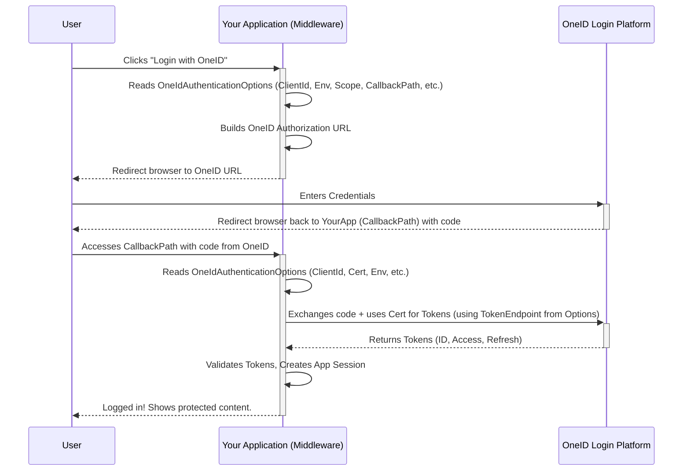

# Chapter 1: OneIdAuthenticationOptions

Welcome to the `oneid-oauth-middleware` tutorial! If you need to let users log into your web application using their Ontario Health OneID credentials, you're in the right place. This middleware makes that process much easier.

This first chapter introduces the most important concept you'll need to understand: `OneIdAuthenticationOptions`.

## What Problem Does `OneIdAuthenticationOptions` Solve?

Imagine you're setting up a new online service, maybe a streaming platform. Before you can use it, you usually need to configure your account, right? You tell it your username, maybe link it to other accounts, and set your preferences.

Similarly, before your application can use OneID for login, it needs instructions. It needs to know:

*   "Who am I?" (What's my application's unique identifier?)
*   "How do I prove who I am securely?" (Where's my security certificate?)
*   "Which OneID system should I talk to?" (Am I testing things out, or is this for real users?)
*   "What permissions do I need?" (What user information can I ask for?)
*   "Where should OneID send the user back after they log in?"

`OneIdAuthenticationOptions` is the place where you provide all these instructions. It's like filling out a configuration form for the OneID middleware. Without these details, the middleware wouldn't know how to connect to OneID or handle the login process correctly.

## Breaking Down the Options

Let's look at the most important settings within `OneIdAuthenticationOptions`:

1.  **`ClientId` (string):**
    *   **Analogy:** Think of this as your application's official ID card when talking to OneID.
    *   **What it is:** A unique identifier given to *your specific application* when you register it with eHealth Ontario (the providers of OneID). OneID uses this to recognize your app. You *must* get this from eHealth Ontario.

2.  **Certificate Details:** OneID requires secure communication using digital certificates. You need to tell the middleware how to find *your* application's certificate. You have two main ways:
    *   **`CertificateThumbprint` (string):**
        *   **Analogy:** Like a unique fingerprint for your certificate that's already stored securely on your computer (or server).
        *   **What it is:** A unique string of characters that identifies a specific certificate installed in the computer's certificate store. This is often preferred for production environments.
    *   **`CertificateFilename` (string) & `CertificatePassword` (SecureString):**
        *   **Analogy:** Like having the certificate in a locked file (the `.pfx` or `.p12` file) and knowing the password to open it.
        *   **What it is:** The path to your certificate file and the password needed to access its private key. Useful if the certificate isn't installed in the store.
    *   **`CertificateStoreLocation` & `CertificateStoreName` (enums):** If using `CertificateThumbprint`, these tell the middleware *where* in the computer's certificate store to look (e.g., `StoreLocation.LocalMachine` and `StoreName.My`).

3.  **`Environment` ([OneIdAuthenticationEnvironment](02_oneidauthenticationenvironment_.md)):**
    *   **Analogy:** Like choosing between different versions of a service: a playground sandbox (`Development`, `PartnerSelfTest`), a practice area (`QualityAssurance`), or the live, real thing (`Production`).
    *   **What it is:** Specifies which OneID server environment your application should connect to. This affects the URLs used for authentication. We'll dive deeper into this in the [next chapter](02_oneidauthenticationenvironment_.md).

4.  **`ServiceProfileOptions` (OneIdAuthenticationServiceProfiles enum) & `Scope` (List<string>):**
    *   **Analogy:** Think of scopes as asking for specific permissions, like asking for the key to the user's basic profile information (`openid`) or keys to access specific health services data (`OLIS`, `DHDR`). `ServiceProfileOptions` is a convenient way to automatically add the correct scopes for common eHealth Ontario services.
    *   **What it is:** Defines *what* your application wants to do or access. `openid` is standard for login. You also need to specify which eHealth Ontario services (like OLIS - Ontario Laboratories Information System or DHDR - Digital Health Drug Repository) your application needs access tokens for, using `ServiceProfileOptions`. This automatically adds the necessary scopes (like `diagnostic_report_search_profile` for OLIS) to the `Scope` list.

5.  **`CallbackPath` (string or PathString):**
    *   **Analogy:** Your application's return address. After the user successfully logs in at the OneID website, OneID needs to know exactly where to send them back to in your application.
    *   **What it is:** The specific URL path on *your* web application that will handle the response from OneID after authentication. For example, `/signin-oneid`. This path must be pre-registered with eHealth Ontario for your `ClientId`.

## How to Use `OneIdAuthenticationOptions`

You typically configure these options when you set up authentication in your application's startup code. Here's a simplified example for an ASP.NET Core application (in `Startup.cs` or `Program.cs`):

```csharp
// Inside your ConfigureServices method (Startup.cs)
// or where you configure services (Program.cs)

// Example using ASP.NET Core Identity
services.AddAuthentication()
    .AddOneId(OneIdAuthenticationDefaults.AuthenticationScheme, options =>
    {
        // 1. Your Application's ID Card
        options.ClientId = Configuration["EHS:AuthClientId"]; // Get from config

        // 2. How to find your Certificate (using Thumbprint here)
        options.CertificateThumbprint = Configuration["EHS:CertificateThumbprint"]; // Get from config
        options.CertificateStoreLocation = StoreLocation.CurrentUser; // Where to look
        options.CertificateStoreName = StoreName.My; // Which store section

        // 3. Which OneID world to use?
        options.Environment = OneIdAuthenticationEnvironment.PartnerSelfTest; // Use the Partner Self-Test environment

        // 4. What permissions/services do you need?
        options.ServiceProfileOptions = OneIdAuthenticationServiceProfiles.OLIS |
                                        OneIdAuthenticationServiceProfiles.DHDR;
        // This automatically adds 'openid', 'diagnostic_report_search_profile',
        // and 'medication_dispense_search_profile' to options.Scope

        // 5. Where OneID sends the user back
        options.CallbackPath = new PathString("/oneid-signin"); // Must match registration!

        // Extra: Save the tokens (like access token) so you can use them later
        options.SaveTokens = true;
        options.TokenSaveOptions = OneIdAuthenticationTokenSave.AccessToken |
                                   OneIdAuthenticationTokenSave.RefreshToken |
                                   OneIdAuthenticationTokenSave.IdToken;
    });

// Ensure you have services.AddSession() and app.UseSession() configured
// if you rely on session for token storage as shown in some examples.
services.AddSession();
```

**Explanation:**

*   We call `AddAuthentication()` and then `.AddOneId()`.
*   The second argument to `AddOneId` is a configuration action where we set the properties of the `OneIdAuthenticationOptions` object (`options`).
*   We set the `ClientId`, certificate details (`CertificateThumbprint`), the target `Environment`, the required `ServiceProfileOptions`, and the `CallbackPath`.
*   We also set `SaveTokens = true` and specify *which* tokens to save using `TokenSaveOptions`. This allows your application to retrieve and use these tokens after the user logs in.
*   Values like `ClientId` and `CertificateThumbprint` are often stored securely in application configuration (like `appsettings.json` or environment variables) rather than directly in the code.

When your application starts, the OneID middleware reads these options and gets ready to handle login requests according to your configuration.

## What Happens Under the Hood? (A Simple Look)

You don't *need* to know the deep internals to use the middleware, but a basic idea helps!

**High-Level Flow:**

1.  A user clicks a "Login with OneID" button in your application.
2.  Your application triggers the OneID authentication scheme.
3.  The [OneIdAuthenticationHandler](04_oneidauthenticationhandler_.md) (part of the middleware) wakes up.
4.  It reads the `OneIdAuthenticationOptions` you configured.
5.  Using the `Environment`, `ClientId`, `Scope` (derived partly from `ServiceProfileOptions`), and `CallbackPath`, it constructs a special URL pointing to the OneID login page.
6.  It redirects the user's browser to that OneID URL.
7.  The user logs in on the OneID site.
8.  OneID redirects the user's browser back to the `CallbackPath` you specified in the options.
9.  The middleware handles this callback, verifies the response (using certificate details for some steps), extracts user information and tokens, and signs the user into *your* application. The options (like `ClientId`, `Environment`, certificate details) are crucial again during this verification step.

**Simplified Diagram:**



**Code Insight:**

The `OneIdAuthenticationOptions.cs` file defines this configuration class.

*   **Defaults:** The constructor sets some sensible defaults, like requesting the `openid` scope automatically.

    ```csharp
    // From: src/AspNet.Security.OAuth.OneID/OneIdAuthenticationOptions.cs
    public OneIdAuthenticationOptions()
    {
        // ... other defaults ...
        Environment = OneIdAuthenticationDefaults.Environment; // Default env
        ResponseType = OpenIdConnectResponseType.Code; // Standard flow type
        UsePkce = true; // Security feature

        // Base scope needed for login
        Scope.Clear();
        Scope.Add("openid");
        // ... more setup ...
    }
    ```

*   **Dynamic Endpoints:** Notice properties like `Authority`, `AuthorizationEndpoint`, `TokenEndpoint`, etc. These aren't usually set directly. Instead, they are calculated *based on the `Environment` you choose*. The `UpdateEndpoints` method inside `OneIdAuthenticationOptions` handles this:

    ```csharp
    // From: src/AspNet.Security.OAuth.OneID/OneIdAuthenticationOptions.cs
    private string GetEnvironment()
    {
        // Converts the enum (e.g., PartnerSelfTest) to the string needed for URLs ("pst")
        return _environment switch
        {
            OneIdAuthenticationEnvironment.PartnerSelfTest => "pst",
            // ... other environments ...
            _ => throw new NotSupportedException(...)
        };
    }

    private void UpdateEndpoints()
    {
        string env = GetEnvironment(); // e.g., "pst"

        // Construct the correct URL based on the environment string
        AuthorizationEndpoint = string.Format(CultureInfo.InvariantCulture,
           FormatStrings.AuthorizeEndpoint, // e.g., "https://login.{0}.oneidfederation.ehealthontario.ca/..."
           env); // Result: "https://login.pst.oneidfederation.ehealthontario.ca/..."

        TokenEndpoint = string.Format(CultureInfo.InvariantCulture,
            FormatStrings.TokenEndpoint,
            env);

        // ... calculates other endpoints like UserInfo, Metadata, EndSession ...

        // Special handling for Production environment URLs
        if (_environment == OneIdAuthenticationEnvironment.Production)
        {
             // Production URLs often don't have the ".prod" part
             AuthorizationEndpoint = AuthorizationEndpoint.Replace(".prod", string.Empty, ...);
             // ... replaces for other endpoints ...
        }
    }
    ```
    This internal logic means you only need to set the `Environment`, and the options class figures out the correct server addresses for you.

## Conclusion

You've learned about `OneIdAuthenticationOptions`, the cornerstone of configuring the `oneid-oauth-middleware`. It's the central "form" you fill out to tell the middleware:

*   Your application's `ClientId`.
*   How to find its security `Certificate`.
*   Which OneID `Environment` to use.
*   What `ServiceProfileOptions` (and therefore `Scopes`) are needed.
*   Your application's `CallbackPath`.

With these options set correctly, the middleware knows exactly how to orchestrate the OneID login process for your users.

In the next chapter, we'll take a closer look at the different choices for the `Environment` setting and what each one means.

Next: [Chapter 2: OneIdAuthenticationEnvironment](02_oneidauthenticationenvironment_.md)

---

Generated by [AI Codebase Knowledge Builder](https://github.com/The-Pocket/Tutorial-Codebase-Knowledge)