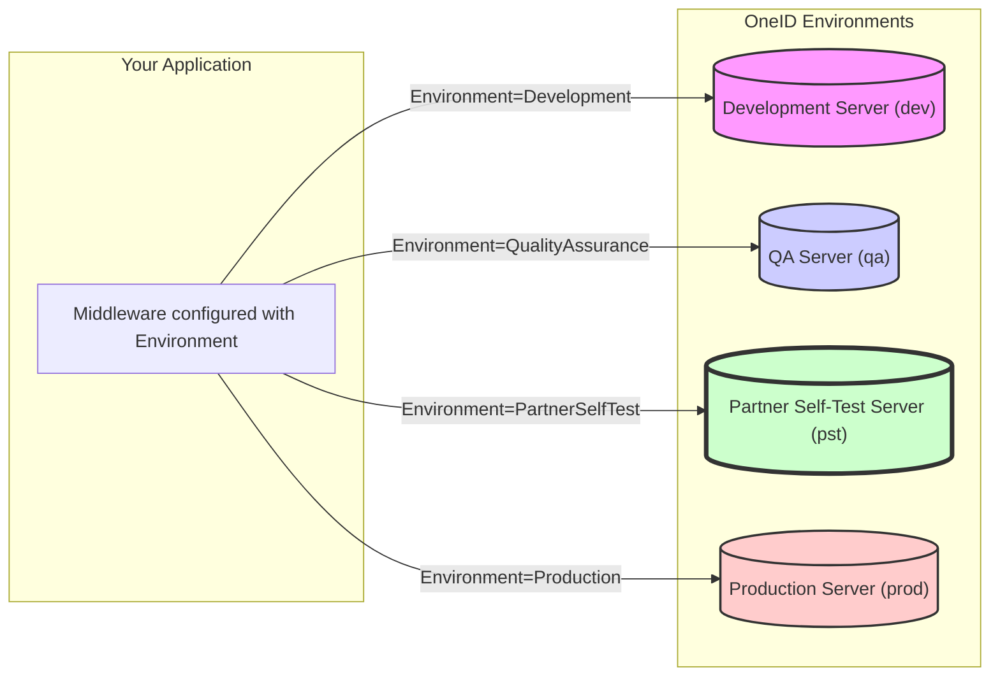

# Chapter 2: OneIdAuthenticationEnvironment

In the [previous chapter](01_oneidauthenticationoptions_.md), we learned about `OneIdAuthenticationOptions`, the main configuration hub for the OneID middleware. One of the key settings we briefly mentioned was `Environment`. Now, let's dive deeper into what this means and why it's so important.

## What Problem Does `OneIdAuthenticationEnvironment` Solve?

Imagine you're building a new feature for your application that uses OneID login. You need to test it thoroughly, right? But you definitely *don't* want your tests to happen on the live, real OneID system that actual users are relying on. That would be like testing a new airplane engine design on a fully loaded passenger jet!

You need a safe place to experiment, test, and make sure everything works perfectly before you release it to the public.

This is exactly what `OneIdAuthenticationEnvironment` helps with. It lets you tell the middleware: "Hey, for now, connect to the *testing* version of OneID, not the real one." Or, when you're ready: "Okay, we're live now, connect to the *real* OneID system."

OneID provides several different "worlds" or environments, each with its own set of servers and databases, completely separate from the others. The `OneIdAuthenticationEnvironment` setting is simply your way of choosing which world your application should talk to.

## Breaking Down the Environments

Think of these environments like different phone numbers for the same company: one for customer support, one for sales, one for internal testing. You need to dial the right number to reach the right department. Similarly, you need to select the right environment to reach the right OneID system.

Here are the available environments you can choose from:

1.  **`Development` (`dev`)**
    *   **Analogy:** Your personal workbench or sandbox.
    *   **Use:** Typically used by developers during the very early stages of coding and testing. It's often the most isolated environment. (Note: Access and availability might depend on eHealth Ontario policies).

2.  **`QualityAssurance` (`qa`)**
    *   **Analogy:** A shared workshop where your team can test the nearly finished product together.
    *   **Use:** Used for internal quality assurance testing before showing the integration to external parties.

3.  **`PartnerSelfTest` (`pst`)**
    *   **Analogy:** The official driving test course provided by the licensing authority.
    *   **Use:** This is a crucial environment provided by eHealth Ontario. You'll use this **extensively** to test your application's integration with OneID using specific test accounts and scenarios provided by eHealth Ontario. Passing tests in PST is often a requirement before you're allowed to connect to Production.

4.  **`Production` (`prod`)**
    *   **Analogy:** The live, public telephone network or the actual highway system.
    *   **Use:** This is the **real OneID system** used by actual healthcare providers in Ontario. You only point your application here when it's fully tested, approved, and ready for live users. **Use with caution!**

Choosing the correct environment is critical because the web addresses (URLs) for logging in, getting security tokens, and fetching user information are **different** for each environment.

## How to Use `OneIdAuthenticationEnvironment`

Remember our configuration example from Chapter 1? Setting the environment is straightforward. Inside the configuration action for `.AddOneId()`, you set the `Environment` property on the `options` object:

```csharp
// Inside your ConfigureServices method (Startup.cs)
// or where you configure services (Program.cs)

services.AddAuthentication()
    .AddOneId(OneIdAuthenticationDefaults.AuthenticationScheme, options =>
    {
        // ... other options like ClientId, Certificate details ...

        // --- Tell the middleware which OneID system to target ---
        // We choose PartnerSelfTest for testing purposes here.
        options.Environment = OneIdAuthenticationEnvironment.PartnerSelfTest;

        // ... other options like ServiceProfileOptions, CallbackPath ...
    });
```

**Explanation:**

*   We access the `options` object, which is an instance of `OneIdAuthenticationOptions`.
*   We set its `Environment` property to one of the values from the `OneIdAuthenticationEnvironment` enumeration (like `PartnerSelfTest`, `Production`, etc.).

That's it! By changing this single line (e.g., from `PartnerSelfTest` to `Production`), you instruct the middleware to use the URLs associated with that specific OneID environment.

**Important Note:** Switching the `Environment` setting in your code is only one part of the process. Your application's `ClientId` and `Certificate` must also be registered and recognized by eHealth Ontario for the *specific environment* you are targeting. A `ClientId` registered for `PartnerSelfTest` won't work in `Production`, and vice-versa.

## What Happens Under the Hood?

When you set `options.Environment`, the middleware doesn't just store the name; it uses that choice to figure out the correct URLs for interacting with OneID.

**Connecting to the Right Server:**

Think of it like a switchboard operator. You tell the operator "Connect me to Testing" (`PartnerSelfTest`), and they plug your line into the testing system. If you say "Connect me to Live" (`Production`), they plug you into the live system.



**Code Insight:**

1.  **The Enum:** First, there's a simple definition listing the possible environment names. This makes your code readable and prevents typos.

    ```csharp
    // From: src/AspNet.Security.OAuth.OneID/OneIdAuthenticationEnvironment.cs

    // Defines the allowed environment choices
    public enum OneIdAuthenticationEnvironment
    {
        Development,        // dev
        QualityAssurance,   // qa
        PartnerSelfTest,    // pst
        Production          // prod
    }
    ```

2.  **Translating the Enum:** Inside the [OneIdAuthenticationOptions](01_oneidauthenticationoptions_.md) class, a helper method translates the enum value (like `PartnerSelfTest`) into a short text code (like `"pst"`) used in the OneID URLs.

    ```csharp
    // From: src/AspNet.Security.OAuth.OneID/OneIdAuthenticationOptions.cs

    // Converts the chosen environment (e.g., PartnerSelfTest)
    // into the short string needed for URLs (e.g., "pst").
    private string GetEnvironment()
    {
        return _environment switch // _environment holds your choice
        {
            OneIdAuthenticationEnvironment.Development => "dev",
            OneIdAuthenticationEnvironment.QualityAssurance => "qa",
            OneIdAuthenticationEnvironment.PartnerSelfTest => "pst",
            OneIdAuthenticationEnvironment.Production => "prod",
            _ => throw new NotSupportedException(...) // Error if invalid
        };
    }
    ```

3.  **Building the URLs:** Another internal method, `UpdateEndpoints`, takes this short code (`"dev"`, `"qa"`, `"pst"`, or `"prod"`) and plugs it into URL templates to create the final addresses.

    ```csharp
    // From: src/AspNet.Security.OAuth.OneID/OneIdAuthenticationOptions.cs

    // This method automatically runs when you set the Environment
    private void UpdateEndpoints()
    {
        string env = GetEnvironment(); // Get the short code (e.g., "pst")

        // Example: Building the URL for starting the login process
        // Template: "https://login.{0}.oneidfederation.ehealthontario.ca/oidc/authorize"
        AuthorizationEndpoint = string.Format(CultureInfo.InvariantCulture,
           FormatStrings.AuthorizeEndpoint, // The template URL string
           env); // Insert the environment code ("pst")

        // Result for PST: "https://login.pst.oneidfederation.ehealthontario.ca/oidc/authorize"

        // Example: Building the URL for exchanging the code for tokens
        // Template: "https://login.{0}.oneidfederation.ehealthontario.ca/oidc/access_token"
        TokenEndpoint = string.Format(CultureInfo.InvariantCulture,
            FormatStrings.TokenEndpoint,
            env);

        // Result for PST: "https://login.pst.oneidfederation.ehealthontario.ca/oidc/access_token"

        // ... it does this for other URLs like UserInfo, EndSession, etc. ...

        // Special case for Production: remove the ".prod" part from URLs
        if (_environment == OneIdAuthenticationEnvironment.Production)
        {
             // Example: Change "login.prod.oneid..." to "login.oneid..."
             AuthorizationEndpoint = AuthorizationEndpoint.Replace(".prod", string.Empty, ...);
             TokenEndpoint = TokenEndpoint.Replace(".prod", string.Empty, ...);
             // ... and so on for other endpoints ...
        }
    }
    ```

This automatic URL generation based on the `Environment` setting saves you from having to manually manage different sets of URLs for testing and production, reducing the chance of errors. You just pick the environment, and the middleware handles the rest.

## Conclusion

You've now learned about `OneIdAuthenticationEnvironment`, a simple but essential setting within [OneIdAuthenticationOptions](01_oneidauthenticationoptions_.md). It acts like a selector switch, allowing you to easily point your application to the correct OneID system – whether it's a safe testing environment like `PartnerSelfTest` or the live `Production` system. By understanding and correctly setting the environment, you ensure your application communicates with the intended OneID servers throughout the development lifecycle.

In the next chapter, we'll explore `OneIdAuthenticationExtensions`, which provide convenient helper methods to register the OneID middleware in your application.

Next: [Chapter 3: OneIdAuthenticationExtensions](03_oneidauthenticationextensions_.md)

---

Generated by [AI Codebase Knowledge Builder](https://github.com/The-Pocket/Tutorial-Codebase-Knowledge)