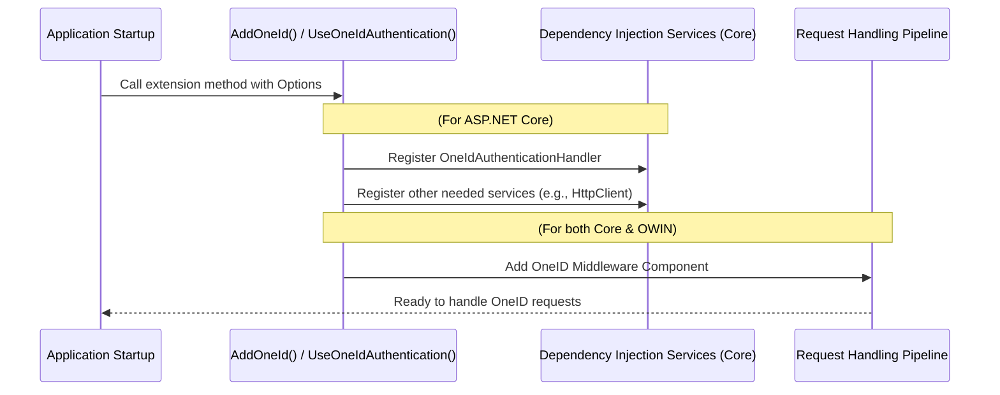

# Chapter 3: OneIdAuthenticationExtensions

In the [previous chapter](02_oneidauthenticationenvironment_.md), we learned about the different `OneIdAuthenticationEnvironment` settings that tell our application which OneID system (like testing or production) to connect to. We configured this setting, along with others, inside the `OneIdAuthenticationOptions` object.

Now, we have our configuration ready, but how do we actually "turn on" the OneID login feature in our web application using these options? That's where `OneIdAuthenticationExtensions` come in!

## What Problem Do `OneIdAuthenticationExtensions` Solve?

Imagine you just bought a new toaster (the OneID middleware). You've read the instruction manual (configured the `OneIdAuthenticationOptions`), but now you need to actually plug it into the wall socket in your kitchen (your web application) so it can get power and start working.

`OneIdAuthenticationExtensions` are like standardized electrical plugs and sockets for your web application framework. They provide simple, helper methods that make it incredibly easy to "plug in" the OneID middleware during your application's startup process. You don't need to manually wire anything complex; you just use the provided extension method, and it handles setting everything up correctly.

There are two main "plugs" depending on the age and type of your kitchen (web framework):

1.  **`AddOneId()`:** For modern ASP.NET Core applications.
2.  **`UseOneIdAuthentication()`:** For older ASP.NET Framework applications that use the OWIN/Katana pipeline.

These methods take the `OneIdAuthenticationOptions` you carefully configured in Chapter 1 and use them to register all the necessary background services and middleware components needed for OneID login to function.

## How to Use `OneIdAuthenticationExtensions`

Using these extensions is the final step in *enabling* the OneID middleware. You'll typically do this in your application's startup configuration file (`Startup.cs` or `Program.cs`).

**1. For Modern ASP.NET Core Applications (`AddOneId`)**

In ASP.NET Core, you configure services in the `ConfigureServices` method (in `Startup.cs`) or near the top of your `Program.cs` file (in newer .NET versions).

```csharp
// In Startup.cs -> ConfigureServices method
// OR in Program.cs before builder.Build()

// 1. Start the authentication setup
builder.Services.AddAuthentication(options =>
{
    // Optional: Set default schemes if needed
    options.DefaultScheme = CookieAuthenticationDefaults.AuthenticationScheme;
    options.DefaultChallengeScheme = OneIdAuthenticationDefaults.AuthenticationScheme;
})
    // 2. Add Cookie authentication (usually needed to store the login session)
    .AddCookie()
    // 3. *** Use the AddOneId extension method ***
    .AddOneId(OneIdAuthenticationDefaults.AuthenticationScheme, options =>
    {
        // --- Configure your OneIdAuthenticationOptions here ---
        // (As shown in Chapter 1)
        options.ClientId = Configuration["EHS:AuthClientId"];
        options.CertificateThumbprint = Configuration["EHS:CertificateThumbprint"];
        options.Environment = OneIdAuthenticationEnvironment.PartnerSelfTest;
        options.CallbackPath = new PathString("/oneid-signin");
        options.ServiceProfileOptions = OneIdAuthenticationServiceProfiles.OLIS;
        options.SaveTokens = true;
        // ... other options ...
    });

// Make sure you also have app.UseAuthentication() later in your pipeline setup
```

**Explanation:**

*   We first call `AddAuthentication` to tell the application we're setting up authentication.
*   We typically add `.AddCookie()` because after logging in with OneID, the user's session in *your* application is usually managed by a cookie.
*   Then, the key part: we chain `.AddOneId()`.
    *   The first argument (`OneIdAuthenticationDefaults.AuthenticationScheme`) gives this specific login method a name (usually just "OneID").
    *   The second argument is where you provide the configuration action for your [OneIdAuthenticationOptions](01_oneidauthenticationoptions_.md), just like we saw in Chapter 1.
*   This single `.AddOneId()` call tells ASP.NET Core to register everything needed for OneID.

**2. For Older ASP.NET Framework (OWIN/Katana) Applications (`UseOneIdAuthentication`)**

In older ASP.NET projects using OWIN/Katana, configuration often happens in a `Startup.Auth.cs` file, inside the `ConfigureAuth` method which receives an `IAppBuilder` named `app`.

```csharp
// In Startup.Auth.cs -> ConfigureAuth method

// Make sure you have Cookie Authentication setup first
app.UseCookieAuthentication(new CookieAuthenticationOptions
{
    AuthenticationType = DefaultAuthenticationTypes.ApplicationCookie,
    LoginPath = new PathString("/Account/Login")
    // ... other cookie options ...
});
// Use a cookie to temporarily store info during external login
app.UseExternalSignInCookie(DefaultAuthenticationTypes.ExternalCookie);


// --- Create an instance of your options ---
var oneIdOptions = new OneIdAuthenticationOptions()
{
    // (As shown in Chapter 1)
    ClientId = ConfigurationManager.AppSettings["EHS:AuthClientId"],
    CertificateThumbprint = ConfigurationManager.AppSettings["EHS:CertificateThumbprint"],
    Environment = OneIdAuthenticationEnvironment.PartnerSelfTest,
    CallbackPath = new PathString("/oneid-signin"),
    ServiceProfileOptions = OneIdAuthenticationServiceProfiles.OLIS | OneIdAuthenticationServiceProfiles.DHDR
    // ... other options ...
};

// *** Use the UseOneIdAuthentication extension method ***
app.UseOneIdAuthentication(oneIdOptions);
```

**Explanation:**

*   Similar to the Core example, we first ensure Cookie Authentication is set up using `app.UseCookieAuthentication(...)` and `app.UseExternalSignInCookie(...)`.
*   We create an instance of `OneIdAuthenticationOptions` and populate it with our settings (often read from `Web.config` via `ConfigurationManager`).
*   The key part: we call `app.UseOneIdAuthentication()` and pass our configured `oneIdOptions` object directly to it.
*   This single call tells the OWIN pipeline to add the OneID middleware using the settings provided.

In both cases, calling the extension method (`AddOneId` or `UseOneIdAuthentication`) with your configured [OneIdAuthenticationOptions](01_oneidauthenticationoptions_.md) is the trigger that activates the OneID middleware in your application.

## What Happens Under the Hood?

When you call `AddOneId()` or `UseOneIdAuthentication()`, it's not magic! These methods perform a few key setup tasks behind the scenes:

1.  **Service Registration (Mainly ASP.NET Core):** `AddOneId()` registers necessary services with the application's dependency injection container. This includes the core logic handler, [OneIdAuthenticationHandler](04_oneidauthenticationhandler_.md), which actually processes the login requests and responses. Think of this like registering the warranty and support contact for your new toaster.
2.  **Middleware Pipeline Insertion:** Both methods ensure that the OneID middleware component is added to the application's request processing pipeline. This pipeline determines how an incoming web request is handled. By inserting the OneID middleware, it gets a chance to intercept requests related to login (like the callback from OneID) and handle them appropriately. This is like plugging the toaster into the socket so it's part of the kitchen's electrical flow.

**Simplified Flow Diagram:**



**Code Insight:**

Let's peek inside `OneIdAuthenticationExtensions.cs` to see the structure.

*   **ASP.NET Core (`AddOneId`)**

    ```csharp
    // From: src/AspNet.Security.OAuth.OneID/OneIdAuthenticationExtensions.cs

    public static AuthenticationBuilder AddOneId(
        this AuthenticationBuilder builder, // Extends AuthenticationBuilder
        string scheme,                     // e.g., "OneID"
        string caption,                    // Display name (optional)
        Action<OneIdAuthenticationOptions> configuration) // Your options setup
    {
        // Argument checks omitted for brevity...

        // Register helper services if not already present
        builder.Services.AddHttpClient(); // For making back-channel calls
        builder.Services.TryAddSingleton<JwtSecurityTokenHandler>(); // For handling tokens
        // ... potentially more services ...

        // *** The core registration step ***
        // It delegates to a generic OAuth handler registration,
        // specifying OUR options and handler type.
        return builder.AddOAuth<OneIdAuthenticationOptions, OneIdAuthenticationHandler>(
            scheme, caption, configuration);
    }
    ```
    *   This extension method takes the `AuthenticationBuilder` and your configuration action.
    *   It registers some common services needed by authentication handlers (like `HttpClient`).
    *   Crucially, it calls `builder.AddOAuth<...>()`, telling the ASP.NET Core framework: "Register an OAuth handler using `OneIdAuthenticationOptions` for configuration and `OneIdAuthenticationHandler` to do the actual work."

*   **OWIN/Katana (`UseOneIdAuthentication`)**

    ```csharp
    // From: src/AspNet.Security.OAuth.OneID/OneIdAuthenticationExtensions.cs

    public static IAppBuilder UseOneIdAuthentication(
        this IAppBuilder app, // Extends IAppBuilder
        OneIdAuthenticationOptions options) // Your configured options object
    {
        if (app == null) throw new ArgumentNullException(nameof(app));
        if (options == null) throw new ArgumentNullException(nameof(options));

        // *** The core registration step ***
        // Tells the OWIN pipeline to use our specific middleware component.
        app.Use(typeof(OneIdAuthenticationMiddleware), app, options);
        return app;
    }
    ```
    *   This extension method takes the OWIN `IAppBuilder` and your configured `OneIdAuthenticationOptions` object.
    *   It directly calls `app.Use(...)`, instructing the OWIN pipeline to insert an instance of `OneIdAuthenticationMiddleware` (which internally uses the [OneIdAuthenticationHandler](04_oneidauthenticationhandler_.md) and the provided `options`) into the request processing flow.

These extension methods act as the convenient "on switch" that connects your configuration (`OneIdAuthenticationOptions`) with the actual machinery ([OneIdAuthenticationHandler](04_oneidauthenticationhandler_.md)) that performs the OneID authentication flow.

## Conclusion

You've now seen how `OneIdAuthenticationExtensions` provide the simple `AddOneId()` (for ASP.NET Core) and `UseOneIdAuthentication()` (for OWIN/Katana) methods. These are the essential "plugs" you use in your application's startup code to activate the OneID middleware. By calling the appropriate extension method and providing your configured [OneIdAuthenticationOptions](01_oneidauthenticationoptions_.md), you register all necessary components and add the OneID functionality to your web application's request pipeline.

With the middleware plugged in, what actually handles the step-by-step process when a user clicks "Login with OneID"? That's the job of the `OneIdAuthenticationHandler`, which we'll explore in the next chapter.

Next: [Chapter 4: OneIdAuthenticationHandler](04_oneidauthenticationhandler_.md)

---

Generated by [AI Codebase Knowledge Builder](https://github.com/The-Pocket/Tutorial-Codebase-Knowledge)