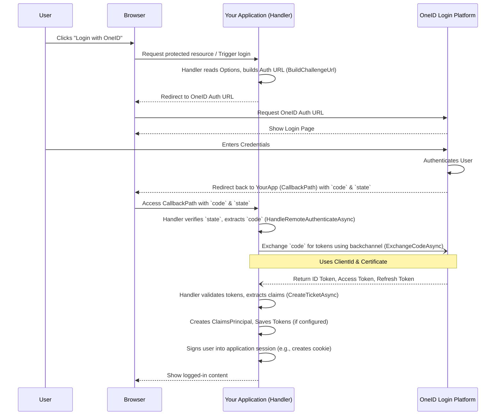

# Chapter 4: OneIdAuthenticationHandler

In the [previous chapter](03_oneidauthenticationextensions_.md), we saw how `OneIdAuthenticationExtensions` like `AddOneId()` act like the power switch, plugging our OneID configuration into our web application. Now that the power is on, who actually does the work? Who manages the security checks when a user tries to log in using OneID?

Meet the `OneIdAuthenticationHandler` – the security guard and engine of the OneID middleware.

## What Problem Does `OneIdAuthenticationHandler` Solve?

Imagine you've hired a security company (the `oneid-oauth-middleware`) for your office building (your web application). You've given them instructions on who to let in and where to send them (using [OneIdAuthenticationOptions](01_oneidauthenticationoptions_.md)), and you've set up their post at the entrance (using [OneIdAuthenticationExtensions](03_oneidauthenticationextensions_.md)).

But you still need an actual *guard* at the post to perform the checks! This guard needs to:

1.  **Guide Visitors:** When someone wants to enter, guide them to the official ID checkpoint (the OneID login page).
2.  **Handle Return:** When they come back with an entry pass (an authorization code), check it.
3.  **Verify Securely:** Go behind the scenes (the backchannel) to securely exchange that pass for official badges (access token, ID token).
4.  **Validate Badges:** Make sure the badges are legitimate and haven't expired.
5.  **Grant Access:** Create an official visitor pass for your building (the user's identity or `ClaimsPrincipal`) so they can access authorized areas.

The `OneIdAuthenticationHandler` is this diligent security guard. It's the component within the middleware that actively manages every step of the OneID login process after you've enabled it. Without it, the middleware wouldn't know how to actually talk to OneID or handle the user's login attempt.

It's important to know that this handler comes in two slightly different versions, tailored for the specific web framework you are using:

*   One version for modern **ASP.NET Core** applications.
*   Another version for older **ASP.NET Framework** applications using **OWIN/Katana**.

While their internal details differ slightly to match their frameworks, their core job remains the same: managing the OneID authentication flow. You generally don't interact with the handler *directly*; the framework uses it automatically based on the setup you did in Chapter 3. However, understanding its role helps you grasp how the entire login process works.

## The Handler's Responsibilities: Step-by-Step

Let's follow our security guard, the `OneIdAuthenticationHandler`, as it manages a user's login attempt:

1.  **Challenge Issued:**
    *   A user clicks "Login with OneID" in your application.
    *   Your application tells the authentication system, "Challenge the user with the OneID scheme."
    *   The `OneIdAuthenticationHandler` wakes up.

2.  **Building the Detour:**
    *   The handler reads the [OneIdAuthenticationOptions](01_oneidauthenticationoptions_.md) you configured (like `ClientId`, `Environment`, `Scope`, `CallbackPath`).
    *   It constructs a special URL pointing to the correct OneID login page (based on the `Environment`). This URL includes information like your `ClientId`, the permissions (`Scope`) you're asking for, and the `CallbackPath` where OneID should send the user back.
    *   *(Handler Method: `BuildChallengeUrl`)*

3.  **Redirecting the User:**
    *   The handler tells the user's browser to go to that OneID URL.
    *   The user leaves your site temporarily and sees the familiar OneID login screen.

4.  **User Authenticates at OneID:**
    *   The user enters their OneID username and password (and possibly performs multi-factor authentication) directly on the secure OneID site. Your application *never* sees these credentials.

5.  **Returning with a Code:**
    *   If login is successful, OneID redirects the user's browser back to the `CallbackPath` you specified in your options.
    *   Crucially, OneID adds a temporary, single-use `code` (an authorization code) to this redirect URL.

6.  **Handling the Callback:**
    *   The user's browser arrives back at your application's `CallbackPath`.
    *   The `OneIdAuthenticationHandler` intercepts this incoming request because it's registered to handle this specific path.
    *   It extracts the `code` and also verifies a `state` parameter to prevent cross-site request forgery (CSRF) attacks.
    *   *(Handler Method: `HandleRemoteAuthenticateAsync` or equivalent)*

7.  **Exchanging the Code for Tokens (Securely):**
    *   This is a critical step! The `code` itself doesn't contain user information.
    *   The handler now makes a *direct, secure, server-to-server* connection to OneID's `TokenEndpoint` (the URL for this is determined by the `Environment` in your options). This is called the "backchannel".
    *   It sends the `code`, your application's `ClientId`, and uses your application's certificate to prove its identity (this certificate usage is often handled by the [OneIdAuthenticationBackChannelHandler](05_oneidauthenticationbackchannelhandler_.md), which the main handler uses).
    *   *(Handler Method: `ExchangeCodeAsync`)*

8.  **Receiving the Tokens:**
    *   If the code is valid and the certificate is trusted, OneID securely sends back a set of tokens:
        *   **ID Token:** Contains information about the authenticated user (like their unique ID, name, etc.). It's like their verified identity card.
        *   **Access Token:** Allows your application to call specific OneID-protected APIs or eHealth Ontario services (like OLIS or DHDR) on behalf of the user, *if* you requested the necessary scopes. It's like a temporary key card for specific service rooms.
        *   **Refresh Token (Optional):** Allows your application to get a new access token after the current one expires, without requiring the user to log in again. It's like a way to renew the key card automatically for a while.

9.  **Validating and Processing Tokens:**
    *   The handler receives these tokens.
    *   It validates the `ID Token`'s signature (using information from OneID) and checks claims like expiration time (`exp`) and audience (`aud`) to ensure it's legitimate and meant for your application.
    *   It extracts the user's information (claims) from the validated `ID Token`.
    *   *(Handler Method: `CreateTicketAsync` and helpers like `ExtractClaimsFromToken`)*

10. **Creating the Application Identity:**
    *   The handler takes the verified user claims and builds a `ClaimsPrincipal` object. This object represents the logged-in user within *your* application's security context (like ASP.NET Core Identity).

11. **Saving Tokens (Optional):**
    *   If you configured `SaveTokens = true` in [OneIdAuthenticationOptions](01_oneidauthenticationoptions_.md), the handler saves the received tokens (ID, access, refresh, based on `TokenSaveOptions`) so your application can retrieve and use them later (e.g., using the access token to call an eHealth service).
    *   *(Handler Method: `CreateTicketAsync`)*

12. **Signing In:**
    *   Finally, the handler tells the web framework (ASP.NET Core or OWIN) to sign the user in, usually by creating an authentication cookie containing the `ClaimsPrincipal`.
    *   The user is now officially logged into your application using their OneID credentials!

Phew! That's a lot of steps, but the `OneIdAuthenticationHandler` manages this entire complex dance for you, ensuring it's done securely according to the OAuth 2.0 and OpenID Connect standards.

## What Happens Under the Hood?

Let's visualize the main flow managed by the handler:



**Code Insight:**

You don't usually call these methods directly, but seeing their structure helps understand the process. The code lives in `OneIdAuthenticationHandler.NetCore.cs` (for ASP.NET Core) and `OneIdAuthenticationHandler.NetFull.cs` (for OWIN/Katana).

*   **Building the Challenge URL (ASP.NET Core Example):** This method adds OneID-specific parameters like `aud` (audience) and `_profile` (service profiles) to the standard OAuth challenge URL.

    ```csharp
    // From: src/AspNet.Security.OAuth.OneID/OneIdAuthenticationHandler.NetCore.cs
    protected override string BuildChallengeUrl(AuthenticationProperties properties, string redirectUri)
    {
        // Calls the base class to build the standard OAuth URL
        var challengeUrl = base.BuildChallengeUrl(properties, redirectUri);

        // Adds the 'aud' parameter required by OneID
        challengeUrl = QueryHelpers.AddQueryString(challengeUrl, "aud", ClaimNames.ApiAudience);

        // Adds the '_profile' parameter based on ServiceProfileOptions
        challengeUrl =
            QueryHelpers.AddQueryString(challengeUrl, "_profile", Options.GetServiceProfileOptionsString());

        // Returns the final URL like:
        // https://login.pst.oneid.ehealthontario.ca/oidc/authorize?client_id=...&scope=...&redirect_uri=...&aud=...&_profile=...
        return challengeUrl;
    }
    ```
    *Explanation:* This code takes the basic login URL and tacks on extra query parameters (`aud`, `_profile`) that OneID specifically requires, using values derived from your [OneIdAuthenticationOptions](01_oneidauthenticationoptions_.md).

*   **Exchanging the Code for Tokens (ASP.NET Core Example):** This method prepares and sends the secure backchannel request to OneID's token endpoint.

    ```csharp
    // From: src/AspNet.Security.OAuth.OneID/OneIdAuthenticationHandler.NetCore.cs
    protected override async Task<OAuthTokenResponse> ExchangeCodeAsync(OAuthCodeExchangeContext context)
    {
        // Prepare the POST request to the Token Endpoint URL from options
        using var request = new HttpRequestMessage(HttpMethod.Post, Options.TokenEndpoint);
        // ... Set standard headers ...

        // Get the 'code_verifier' needed for PKCE security
        if (!context.Properties.Items.TryGetValue("code_verifier", out var codeVerifierValue))
        {
            throw new InvalidOperationException("code_verifier is missing");
        }

        // Parameters for the token request body
        var parameters = new Dictionary<string, string>
        {
            ["redirect_uri"] = context.RedirectUri, // Must match original request
            ["grant_type"] = "authorization_code",  // Standard grant type
            ["client_id"] = Options.ClientId,       // Your app's ID from options
            ["code"] = context.Code,                // The authorization code received
            ["code_verifier"] = codeVerifierValue ?? string.Empty // PKCE verifier
        };

        // Set the request body
        request.Content = new FormUrlEncodedContent(parameters.AsEnumerable());

        // Send the request using the configured Backchannel (which uses the certificate)
        using var response = await Backchannel.SendAsync(request, Context.RequestAborted).ConfigureAwait(false);

        // Check for errors and parse the successful JSON response containing tokens
        if (!response.IsSuccessStatusCode)
        {
            // ... Handle error ...
            var errorBody = await response.Content.ReadAsStringAsync().ConfigureAwait(false);
            Logger.LogBackchannelFailure(response.StatusCode, response.Headers.ToString(), errorBody);
            return OAuthTokenResponse.Failed(new OneIdAuthenticationException(...));
        }

        // Parse the JSON response from OneID (contains access_token, id_token, etc.)
        var payload = JsonDocument.Parse(await response.Content.ReadAsStringAsync().ConfigureAwait(false));
        return OAuthTokenResponse.Success(payload);
    }
    ```
    *Explanation:* This code constructs the secure request to trade the `code` for tokens. It includes the `code`, your `ClientId`, the `redirect_uri`, and security parameters like `code_verifier`. It then uses the `Backchannel` (which involves the [OneIdAuthenticationBackChannelHandler](05_oneidauthenticationbackchannelhandler_.md) and your certificate) to send this request and process the response containing the tokens.

*   **Creating the Ticket (User Identity) (ASP.NET Core Example):** After getting tokens, this method validates the ID token, extracts claims, and creates the `ClaimsPrincipal`.

    ```csharp
    // From: src/AspNet.Security.OAuth.OneID/OneIdAuthenticationHandler.NetCore.cs
    protected override async Task<AuthenticationTicket> CreateTicketAsync(ClaimsIdentity identity,
        AuthenticationProperties properties, OAuthTokenResponse tokens)
    {
        // Get the ID token string from the response
        var idToken = tokens.Response!.RootElement.GetString("id_token");
        if (string.IsNullOrWhiteSpace(idToken)) { /* ... error ... */ }

        // Optional: Validate the ID token's signature and claims
        if (Options.ValidateTokens)
        {
            var validateIdContext = new OneIdValidateIdTokenContext(Context, Scheme, Options, idToken);
            await Events.ValidateIdToken(validateIdContext).ConfigureAwait(false);
        }

        // Extract claims (user info) from the ID token
        foreach (var claim in ExtractClaimsFromToken(idToken))
        {
            identity.AddClaim(claim);
        }

        // Create the final user principal (identity for the app)
        var principal = new ClaimsPrincipal(identity);

        // Context for further processing and claim actions
        var context = new OAuthCreatingTicketContext(principal, properties, Context, Scheme, Options, Backchannel,
            tokens, tokens.Response!.RootElement);

        // Optional: Save tokens to session or properties if configured
        if (Options.SaveTokens /* ... and check TokenSaveOptions ... */)
        {
           // Code to save id_token, access_token, refresh_token
           // Example: context.HttpContext.Session.SetString("id_token", idToken);
           // Or: SaveToken(properties, idToken, "id_token");
        }

        // Allow for custom claim transformations
        context.RunClaimActions();

        // Allow application code to hook into the ticket creation
        await Events.CreatingTicket(context).ConfigureAwait(false);

        // Return the final AuthenticationTicket containing the user identity and properties
        return new AuthenticationTicket(context.Principal!, context.Properties, Scheme.Name);
    }
    ```
    *Explanation:* This code takes the tokens received from `ExchangeCodeAsync`, focuses on the `id_token`, validates it (if configured), pulls out user details (`ExtractClaimsFromToken`), builds the user's identity (`ClaimsPrincipal`), saves the tokens (if `SaveTokens` is true), and wraps everything in an `AuthenticationTicket` for the framework to use for signing the user in.

## Conclusion

The `OneIdAuthenticationHandler` is the unsung hero of the OneID login process within the middleware. Acting like a meticulous security guard, it manages the entire flow: redirecting the user to OneID, handling the callback, securely exchanging the authorization code for tokens via the backchannel, validating those tokens, and finally creating the user's identity for your application. You don't configure it directly, but understanding its crucial role helps demystify how OneID login works behind the scenes after you've set up the [OneIdAuthenticationOptions](01_oneidauthenticationoptions_.md) and enabled the middleware with [OneIdAuthenticationExtensions](03_oneidauthenticationextensions_.md).

One particularly sensitive part of the handler's job is the secure backchannel communication where it exchanges the code for tokens using your application's certificate. How is that secure connection handled? That's the job of the `OneIdAuthenticationBackChannelHandler`, which we'll explore next.

Next: [Chapter 5: OneIdAuthenticationBackChannelHandler](05_oneidauthenticationbackchannelhandler_.md)

---

Generated by [AI Codebase Knowledge Builder](https://github.com/The-Pocket/Tutorial-Codebase-Knowledge)