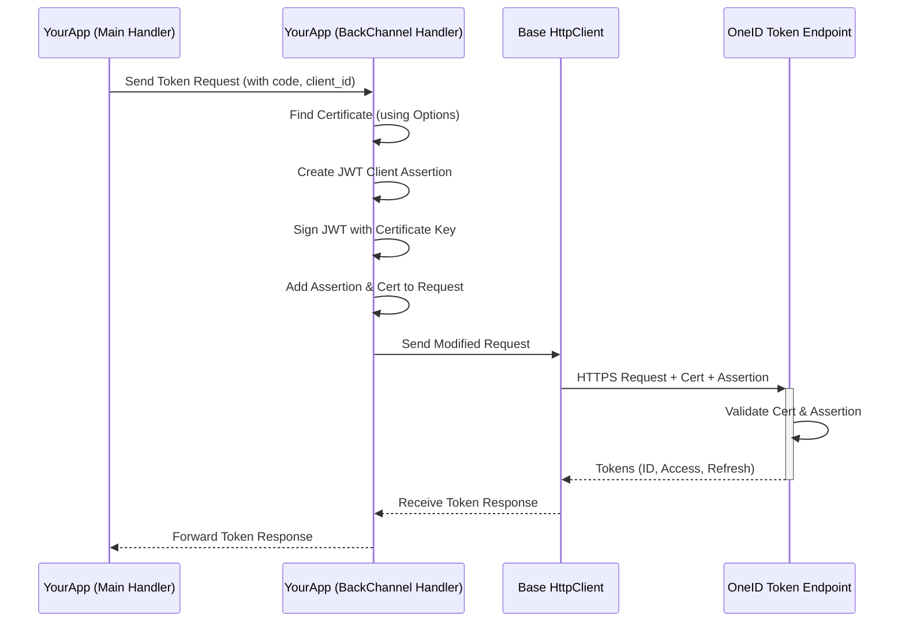

# Chapter 5: OneIdAuthenticationBackChannelHandler

In the [previous chapter](04_oneidauthenticationhandler_.md), we learned about the `OneIdAuthenticationHandler`, the main "security guard" managing the OneID login flow. We saw that one of its crucial tasks is to securely exchange the temporary `code` (received from OneID via the user's browser) for actual user tokens (ID token, access token) by talking directly to OneID's `TokenEndpoint`. This direct server-to-server communication happens over a secure "backchannel".

But how does your application prove its *own* identity during this sensitive backchannel exchange? How does OneID know that the request to swap the code for tokens is really coming from *your* registered application and not an imposter? This is where the `OneIdAuthenticationBackChannelHandler` comes in.

## What Problem Does `OneIdAuthenticationBackChannelHandler` Solve?

Imagine our security guard ([OneIdAuthenticationHandler](04_oneidauthenticationhandler_.md)) needs to send a top-secret message (the authorization `code`) back to headquarters (OneID's Token Endpoint) to get the official entry badges (tokens). They can't just send it via regular mail; it needs to be highly secure. They need a special courier who knows how to:

1.  **Prepare a Secure Pouch:** Create a tamper-proof package for the message.
2.  **Include Official Credentials:** Put the building's official seal (your application's private certificate) on the pouch.
3.  **Write a Signed Letter of Introduction:** Craft a special, digitally signed letter (a JWT called a "client assertion") confirming the message is legitimately from your application.

The `OneIdAuthenticationBackChannelHandler` is this specialized courier and document preparer. It's a low-level component focused *only* on making the outgoing backchannel requests (specifically the token request) secure and verifiable. Its main jobs are:

*   **Finding the Certificate:** Locating your application's private certificate based on the settings you provided in [OneIdAuthenticationOptions](01_oneidauthenticationoptions_.md) (like `CertificateThumbprint` or `CertificateFilename`). It uses a helper called `OneIdCertificateUtility` for this.
*   **Creating the Client Assertion:** Generating a unique, short-lived, digitally signed JSON Web Token (JWT). This JWT contains claims identifying your application (`ClientId`) and is signed using your private certificate. This proves to OneID that the request originated from the legitimate owner of the certificate associated with your `ClientId`.
*   **Attaching Credentials:** Ensuring both the client assertion JWT and the certificate itself are properly attached to the outgoing HTTP request being sent to OneID's Token Endpoint.

Essentially, it handles the specific security requirements OneID imposes for the critical step of exchanging the code for tokens, proving your application's identity beyond just the `ClientId`.

**Important Note:** You generally **don't interact directly** with `OneIdAuthenticationBackChannelHandler`. It works behind the scenes. The main [OneIdAuthenticationHandler](04_oneidauthenticationhandler_.md) uses it automatically when making the backchannel call (the `ExchangeCodeAsync` step we saw previously). You configure the *inputs* it needs (certificate details) in [OneIdAuthenticationOptions](01_oneidauthenticationoptions_.md).

## Breaking Down the Key Tasks

1.  **Certificate Lookup:**
    *   **Analogy:** The courier needs to find the official company seal before preparing the package.
    *   **How it works:** It reads the `CertificateThumbprint` (and store details) or `CertificateFilename`/`Password` from the [OneIdAuthenticationOptions](01_oneidauthenticationoptions_.md). It then uses `OneIdCertificateUtility` to fetch the actual `X509Certificate2` object from the specified location (Windows Certificate Store or a file).

2.  **Client Assertion Creation:**
    *   **Analogy:** The courier writes a formal letter stating, "This message is from Application XYZ, sent at this specific time," and signs it with an unforgeable signature using the company seal.
    *   **How it works:** It creates a JWT with specific claims:
        *   `iss` (Issuer): Your application's `ClientId`.
        *   `sub` (Subject): Your application's `ClientId`.
        *   `aud` (Audience): The intended recipient, usually OneID's Token Endpoint URL (derived from [OneIdAuthenticationOptions](01_oneidauthenticationoptions_.md)).
        *   `iat` (Issued At): The current time.
        *   `exp` (Expiration Time): A short time in the future (e.g., 20 minutes).
        *   `jti` (JWT ID): A unique random identifier for this specific token.
    *   It then digitally signs this JWT using the private key of the certificate it just looked up.

3.  **Attaching to Request:**
    *   **Analogy:** The courier puts the signed letter (`client_assertion`) inside the secure pouch (`HttpRequestMessage`) and makes sure the official seal (the certificate itself, used for the HTTPS connection) is visible.
    *   **How it works:**
        *   It modifies the outgoing `HttpRequestMessage` that the [OneIdAuthenticationHandler](04_oneidauthenticationhandler_.md) prepared for the token endpoint.
        *   It adds the generated JWT as a parameter named `client_assertion`.
        *   It adds another parameter `client_assertion_type` with the value `urn:ietf:params:oauth:client-assertion-type:jwt-bearer`.
        *   As an `HttpClientHandler`, it also automatically attaches the client certificate to the underlying HTTPS connection itself, allowing server-level validation.

## How is it Used? (Under the Hood)

You don't call this handler directly. When you configure the OneID middleware using `.AddOneId()` (as seen in [Chapter 3](03_oneidauthenticationextensions_.md)), the options you provide, particularly the certificate details in [OneIdAuthenticationOptions](01_oneidauthenticationoptions_.md), are used to create an instance of this `OneIdAuthenticationBackChannelHandler`. This instance is then automatically assigned to the `BackchannelHttpHandler` property of the main `OneIdAuthenticationHandler`.

```csharp
// Simplified view from AddOneId() setup:
services.AddAuthentication()
    .AddOneId(options => {
        options.ClientId = "...";
        // *** You configure the certificate here ***
        options.CertificateThumbprint = "YOUR_CERT_THUMBPRINT";
        options.CertificateStoreLocation = StoreLocation.LocalMachine;
        options.CertificateStoreName = StoreName.My;
        // ... other options ...

        // *** Middleware automatically does this internally: ***
        // options.BackchannelHttpHandler =
        //     new OneIdAuthenticationBackChannelHandler(options);
    });
```

When the [OneIdAuthenticationHandler](04_oneidauthenticationhandler_.md)'s `ExchangeCodeAsync` method makes the HTTP call to the token endpoint, it uses the configured `BackchannelHttpHandler`. This means our `OneIdAuthenticationBackChannelHandler` gets activated automatically to perform its security tasks just before the request goes out.

## What Happens Under the Hood?

Let's trace the steps specifically involving the backchannel handler during the token exchange:

**Simplified Flow:**

1.  The main [OneIdAuthenticationHandler](04_oneidauthenticationhandler_.md) decides it needs to exchange the `code` for tokens.
2.  It prepares a standard `HttpRequestMessage` containing the `code`, `client_id`, `grant_type`, etc.
3.  It uses its configured `Backchannel` (which uses the `OneIdAuthenticationBackChannelHandler`) to send this request.
4.  **`OneIdAuthenticationBackChannelHandler` intercepts the outgoing request.**
5.  It reads certificate details from its configured `OneIdAuthenticationOptions`.
6.  It calls `OneIdCertificateUtility.FindCertificateByThumbprint` (or reads from file) to get the `X509Certificate2`.
7.  It creates the JWT client assertion, signing it with the certificate's private key.
8.  It modifies the `HttpRequestMessage` to include `client_assertion` and `client_assertion_type` parameters.
9.  It attaches the certificate to the HTTPS connection handler.
10. **It passes the modified request to the base `HttpClientHandler` to actually send it over the network.**
11. OneID receives the request, validates the HTTPS certificate, validates the `client_assertion` JWT signature and claims.
12. If valid, OneID processes the token exchange and sends back the tokens.
13. The response travels back through the handlers to the main `OneIdAuthenticationHandler`.

**Simplified Diagram:**



**Code Insight:**

Let's look at simplified snippets from `OneIdAuthenticationBackChannelHandler.cs`.

*   **Finding the Certificate:**

    ```csharp
    // From: src/AspNet.Security.OAuth.OneID/OneIdAuthenticationBackChannelHandler.cs

    // Inside the SendAsync method override:
    protected override async Task<HttpResponseMessage> SendAsync(HttpRequestMessage request, CancellationToken cancellationToken)
    {
        X509Certificate2? cert = null;
        try
        {
            // Check if Thumbprint is configured in options
            if (!string.IsNullOrEmpty(_options.CertificateThumbprint))
            {
                // Use utility to find the cert in the specified store
                cert = OneIdCertificateUtility.FindCertificateByThumbprint(
                    _options.CertificateStoreName,
                    _options.CertificateStoreLocation,
                    _options.CertificateThumbprint,
                    false); // 'false' means don't require validation here
            }
            // Else if Filename is configured... (simplified)
            else if (!string.IsNullOrEmpty(_options.CertificateFilename))
            {
                 // Read file bytes, create certificate object
                 var certBytes = File.ReadAllBytes(_options.CertificateFilename);
                 cert = new X509Certificate2(certBytes, _options.CertificatePassword, ...);
            }

            if (cert == null)
            {
                throw new InvalidOperationException("Certificate not found!");
            }
            // ... rest of the logic using 'cert' ...
    ```
    *Explanation:* This code checks the `_options` (which are your [OneIdAuthenticationOptions](01_oneidauthenticationoptions_.md)) to see how the certificate is specified (thumbprint or file) and then uses the helper `OneIdCertificateUtility` or file reading to load the actual certificate object.

*   **Creating the Client Assertion JWT:**

    ```csharp
    // From: src/AspNet.Security.OAuth.OneID/OneIdAuthenticationBackChannelHandler.cs
    // Still inside SendAsync, after getting the 'cert':

        // Wrap the cert in a security key object
        X509SecurityKey key = new(cert);
        // Specify the signing algorithm
        SigningCredentials credentials = new(key, SecurityAlgorithms.RsaSha256);

        // Set issuance and expiration times (e.g., expires in 20 mins)
        var now = DateTimeOffset.Now.ToUnixTimeSeconds();
        var expire = DateTimeOffset.Now.AddMinutes(20).ToUnixTimeSeconds();

        // Define the claims for the JWT
        var permClaims = new List<Claim>
        {
            new("iss", _options.ClientId), // Issuer = Your App ID
            new("sub", _options.ClientId), // Subject = Your App ID
            new("aud", _options.Audience), // Audience = OneID Token Endpoint
            new("iat", now.ToString(...), ClaimValueTypes.Integer64), // Issued At
            new("exp", expire.ToString(...), ClaimValueTypes.Integer64), // Expiration
            new("jti", Guid.NewGuid().ToString("N")) // Unique JWT ID
        };

        // Create the JWT object with claims and signing credentials
        var token = new JwtSecurityToken(claims: permClaims, signingCredentials: credentials);

        // Convert the token object into its string representation
        var jwtToken = new JwtSecurityTokenHandler().WriteToken(token);

        // 'jwtToken' now holds the signed client assertion string.
        // ... code to add jwtToken to the request follows ...
    ```
    *Explanation:* This part constructs the JWT. It defines the necessary claims (who issued it, who it's for, when it expires) using details from your options and the current time. It then uses the certificate's key (`credentials`) to sign this information, producing the final `jwtToken` string.

*   **Adding Assertion to the Request:**

    ```csharp
    // From: src/AspNet.Security.OAuth.OneID/OneIdAuthenticationBackChannelHandler.cs
    // Still inside SendAsync, after creating 'jwtToken':

        // Read the original request parameters
        var oldContent = await request.Content.ReadAsStringAsync(cancellationToken);
        var data = oldContent.Split('&').ToDictionary(x => x.Split('=')[0], x => Uri.UnescapeDataString(x.Split('=')[1]));

        // Add/replace the client assertion parameters
        data["client_assertion_type"] = "urn:ietf:params:oauth:client-assertion-type:jwt-bearer";
        data["client_assertion"] = jwtToken; // Add the signed JWT string

        // Add the audience parameter again (as required by OneID)
        data["aud"] = ClaimNames.ApiAudience;

        // Put the modified parameters back into the request content
        request.Content = new FormUrlEncodedContent(data);

        // Pass the modified request to the base handler to send
        return await base.SendAsync(request, cancellationToken);
    ```
    *Explanation:* This code takes the existing parameters being sent to the token endpoint (like `code`, `client_id`, `grant_type`), adds the `client_assertion` (containing the JWT we just created) and `client_assertion_type`, and updates the `aud` parameter. It then repackages these parameters into the `request.Content` before finally calling `base.SendAsync` to send the request on its way. The certificate attachment for the HTTPS connection happens automatically because this class inherits from `HttpClientHandler` and the certificate is loaded.

## Conclusion

The `OneIdAuthenticationBackChannelHandler` is a vital but hidden component responsible for the specialized security required during the backchannel token exchange. It acts like a secure courier, automatically finding your application's certificate (based on your [OneIdAuthenticationOptions](01_oneidauthenticationoptions_.md)), creating a digitally signed "letter of introduction" (the client assertion JWT), and attaching these credentials to the outgoing request to OneID's Token Endpoint. By handling this complex security procedure, it allows the main [OneIdAuthenticationHandler](04_oneidauthenticationhandler_.md) to securely prove your application's identity when trading the authorization code for user tokens. You don't configure it directly, but knowing it's there helps understand the robust security mechanisms protecting the OneID flow.

In the next chapter, we'll look at `OneIdHelper`, a utility class offering helpful functions you *can* use directly in your application code, particularly for managing tokens after login.

Next: [Chapter 6: OneIdHelper](06_oneidhelper_.md)

---

Generated by [AI Codebase Knowledge Builder](https://github.com/The-Pocket/Tutorial-Codebase-Knowledge)