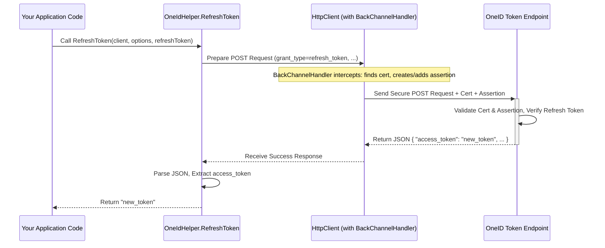

# Chapter 6: OneIdHelper

In the [previous chapter](05_oneidauthenticationbackchannelhandler_.md), we explored the `OneIdAuthenticationBackChannelHandler`, the specialized component ensuring your application securely proves its identity when exchanging an authorization code for tokens. That process happens *during* the initial login flow.

But what happens *after* the user is successfully logged in? Your application might need to perform other actions related to the user's OneID session, like properly logging them out or renewing their access if it's about to expire. How do you do these things correctly?

That's where `OneIdHelper` comes to the rescue!

## What Problem Does `OneIdHelper` Solve?

Imagine your user has logged into your application using their OneID credentials. Later, they click your "Logout" button. If you *only* sign them out of your application's session, their main OneID session might still be active. If they immediately click "Login with OneID" again, they might get logged back in without entering their password, which might not be the desired behaviour. You need a way to tell OneID itself to end the user's session.

Another scenario: Access tokens (which grant access to services like OLIS or DHDR) expire after a certain time (e.g., an hour). If the user is actively using your application, you don't want to force them to log in again just because the token expired. If you received a "refresh token" during the initial login, you can use it to silently get a *new* access token from OneID without interrupting the user.

Performing these tasks (logout, token refresh) requires constructing specific URLs or making secure calls to OneID with the correct parameters. `OneIdHelper` provides ready-made functions to handle these common post-login tasks easily and correctly. It's like a small toolkit specifically for managing the user's OneID session *after* they've logged in.

## What is `OneIdHelper`?

`OneIdHelper` is a **static class**. This means you don't need to create an instance of it; you can use its functions directly by typing `OneIdHelper.` followed by the function name (e.g., `OneIdHelper.GetEndSessionUrl(...)`). Think of it as a public utility shed with helpful tools inside – you just grab the tool you need when you need it.

It provides convenient methods for:

1.  **Generating the OneID Logout URL (`GetEndSessionUrl`)**: Creates the correct URL to redirect the user to for logging out of their central OneID session.
2.  **Refreshing an Access Token (`RefreshToken`)**: Uses a refresh token to obtain a new access token from OneID without requiring the user to log in again.

Let's look at how to use these tools.

## Using `OneIdHelper`

### 1. Logging Out Fully (`GetEndSessionUrl`)

When a user logs out of your application, you should ideally also end their main OneID session. This function helps you build the URL for that.

**How to Use:**

You need the user's `id_token` (which you should have saved if you configured `SaveTokens = true` and `TokenSaveOptions` in [OneIdAuthenticationOptions](01_oneidauthenticationoptions_.md)) and your application's `OneIdAuthenticationOptions`.

```csharp
using AspNet.Security.OAuth.OneID;
using Microsoft.AspNetCore.Authentication; // For GetTokenAsync
using Microsoft.Extensions.Options; // For IOptions
using System;
using Microsoft.AspNetCore.Mvc; // For Redirect result

// Inside your Logout action method (e.g., in an ASP.NET Core Controller)
public async Task<IActionResult> Logout()
{
    // Retrieve the saved ID token (e.g., from authentication properties or session)
    var idToken = await HttpContext.GetTokenAsync("id_token");

    // Get your application's OneIdAuthenticationOptions
    // (How you get this depends on your setup, IOptions is common)
    // Example: Inject IOptions<OneIdAuthenticationOptions> optionsAccessor in constructor
    var oneIdOptions = _optionsAccessor.Value; // Assume _optionsAccessor is injected

    // An optional URL to redirect the user back to *after* they log out from OneID
    // This URL must be pre-registered with OneID for your client application.
    var postLogoutRedirectUrl = Url.Page("/Index", pageHandler: null,
        values: null, protocol: Request.Scheme);

    if (!string.IsNullOrEmpty(idToken))
    {
        // *** Use the helper to get the logout URL ***
        var logoutUrl = OneIdHelper.GetEndSessionUrl(
            idToken,
            oneIdOptions,
            new Uri(postLogoutRedirectUrl) // Optional redirect back URL
        );

        // First, sign the user out of your application's session
        await HttpContext.SignOutAsync(); // e.g., CookieAuthenticationDefaults.AuthenticationScheme

        // Then, redirect the user to the OneID logout page
        return Redirect(logoutUrl);
    }
    else
    {
        // If no id_token, just sign out locally
        await HttpContext.SignOutAsync();
        return RedirectToPage("/Index"); // Or wherever appropriate
    }
}
```

**Explanation:**

1.  We retrieve the `id_token` that was stored when the user logged in.
2.  We get the instance of our application's `OneIdAuthenticationOptions` (which contains our `ClientId` and `Environment`).
3.  We optionally define a `postLogoutRedirectUrl` where OneID should send the user *after* they log out from the OneID page. **This URL must be registered with eHealth Ontario for your application.**
4.  We call `OneIdHelper.GetEndSessionUrl`, passing the `idToken`, the `options`, and the optional `postLogoutRedirectUrl`.
5.  The helper returns a URL string (e.g., `https://login.pst.oneidfederation.ehealthontario.ca/oidc/connect/endSession?id_token_hint=...&client_id=...&post_logout_redirect_uri=...`).
6.  We first sign the user out of our *local* application session (e.g., remove the cookie).
7.  We then redirect the user's browser to the `logoutUrl` obtained from the helper. This takes them to the OneID page to confirm logout, and then redirects them back to our `postLogoutRedirectUrl` if provided.

### 2. Renewing Access (`RefreshToken`)

If you need to call an eHealth service (like OLIS) but the user's access token might have expired, you can use the refresh token (if available) to get a new one.

**How to Use:**

You need:
*   The user's `refresh_token` (saved during login).
*   Your application's `OneIdAuthenticationOptions`.
*   An `HttpClient` instance that is configured to use the [OneIdAuthenticationBackChannelHandler](05_oneidauthenticationbackchannelhandler_.md). This is crucial because refreshing a token also requires your application to prove its identity using its certificate, just like the initial code exchange.

```csharp
using AspNet.Security.OAuth.OneID;
using Microsoft.AspNetCore.Authentication; // For GetTokenAsync
using Microsoft.Extensions.Options; // For IOptions
using System.Net.Http; // For HttpClient
using System.Threading.Tasks;
using Microsoft.AspNetCore.Http; // For ISession

// Example method that needs a valid access token
public async Task CallHealthService()
{
    // Retrieve saved tokens
    var accessToken = await HttpContext.GetTokenAsync("access_token");
    var refreshToken = await HttpContext.GetTokenAsync("refresh_token");

    // Get options (e.g., via dependency injection)
    var oneIdOptions = _optionsAccessor.Value;

    // Check if access token is expired (you might need logic to check this)
    bool isExpired = /* ... logic to check if accessToken is expired ... */ true;

    if (isExpired && !string.IsNullOrEmpty(refreshToken))
    {
        try
        {
            // *** IMPORTANT: Create HttpClient with the backchannel handler ***
            // This ensures the request includes the necessary client certificate
            // and assertion.
            using var backchannelHandler = new OneIdAuthenticationBackChannelHandler(oneIdOptions);
            using var client = new HttpClient(backchannelHandler);

            _logger.LogInformation("Access token expired, attempting refresh...");

            // *** Use the helper to refresh the token ***
            var newAccessToken = await OneIdHelper.RefreshToken(
                client,
                oneIdOptions,
                refreshToken
            );

            if (!string.IsNullOrEmpty(newAccessToken))
            {
                accessToken = newAccessToken;
                _logger.LogInformation("Token refresh successful.");

                // *** IMPORTANT: Update the stored access token ***
                // You need to store this new token for future use.
                // How you store it depends on your setup (e.g., update auth properties, session)
                // Example: Store in session (if using session to store tokens)
                 HttpContext.Session.SetString("access_token", accessToken);

                 // Note: OneID might also return a new refresh token. The current helper
                 // only returns the access token, but a real implementation might need
                 // to parse the full response to get and store a new refresh token too.
            }
            else
            {
                 _logger.LogWarning("Token refresh failed, received empty token.");
                 // Handle scenario where refresh failed (e.g., redirect to login)
                 return;
            }
        }
        catch (Exception ex)
        {
            _logger.LogError(ex, "Exception during token refresh.");
            // Handle exception (e.g., redirect to login)
            return;
        }
    }

    if (string.IsNullOrEmpty(accessToken))
    {
        _logger.LogWarning("No valid access token available.");
        // Handle scenario where no token is available (e.g., redirect to login)
        return;
    }

    // Now use the potentially refreshed 'accessToken' to call the service
    _logger.LogInformation("Calling service with access token.");
    // httpClientForService.DefaultRequestHeaders.Authorization =
    //     new AuthenticationHeaderValue("Bearer", accessToken);
    // var response = await httpClientForService.GetAsync(...);
    // ...
}
```

**Explanation:**

1.  We retrieve the stored `access_token` and `refresh_token`.
2.  We get our `OneIdAuthenticationOptions`.
3.  We determine if the `access_token` has expired (this logic is application-specific).
4.  **Crucially**, if expired and we have a `refresh_token`, we create an `HttpClient` instance using `OneIdAuthenticationBackChannelHandler`, passing our `oneIdOptions` to its constructor. This ensures the client certificate and client assertion JWT are automatically handled for the outgoing request.
5.  We call `OneIdHelper.RefreshToken`, passing the special `client`, the `options`, and the `refreshToken`.
6.  The helper makes a secure POST request to OneID's token endpoint.
7.  If successful, it returns the `newAccessToken` string.
8.  **Very important:** We must update our stored access token with this new value so subsequent calls use the fresh token. (The example uses session state, but updating authentication properties might be better depending on your setup). *Note: A robust implementation should also check if OneID returned a new refresh token and store that too.*
9.  We handle potential errors during the refresh process.
10. We can now proceed to use the (potentially refreshed) `accessToken` to call the target service.

## What Happens Under the Hood?

### `GetEndSessionUrl` Internals

This function is relatively straightforward:

1.  **Input:** Takes `idToken`, `options`, and optional `postLogoutUri`.
2.  **Determine Endpoint:** It looks at `options.Environment` ([OneIdAuthenticationEnvironment](02_oneidauthenticationenvironment_.md)) to find the correct base URL for the OneID "end session" endpoint (e.g., `https://login.pst.../oidc/connect/endSession`).
3.  **Build Query String:** It creates a dictionary of query parameters:
    *   `id_token_hint`: Set to the provided `idToken`.
    *   `client_id`: Set to `options.ClientId` from your [OneIdAuthenticationOptions](01_oneidauthenticationoptions_.md).
    *   `post_logout_redirect_uri`: Set to the `postLogoutUri` if provided.
4.  **Assemble URL:** It combines the endpoint URL and the URL-encoded query string parameters.
5.  **Output:** Returns the final URL string.

**Code Snippet (`OneIdHelper.cs`):**

```csharp
// From: src/AspNet.Security.OAuth.OneID/OneIdHelper.cs

public static string GetEndSessionUrl(string idToken, OneIdAuthenticationOptions options, Uri? postLogoutUri = null)
{
    // Input validation... (omitted for brevity)

    // Prepare query parameters
    var queryValues = new Dictionary<string, string?>
    {
        {OAuth2Constants.IdTokenHint, idToken}, // id_token_hint=...
        {OAuth2Constants.ClientId, options.ClientId} // client_id=...
    };

    // Add optional post-logout redirect URI
    if (postLogoutUri != null)
        queryValues.Add(OAuth2Constants.PostLogoutRedirectUri,
           HttpUtility.UrlDecode(postLogoutUri.ToString())); // post_logout_redirect_uri=...

    // Get the correct OneID endpoint based on environment
    var tokenEndpoint = options.Environment switch
    {
        OneIdAuthenticationEnvironment.Production => "...",
        OneIdAuthenticationEnvironment.PartnerSelfTest => "https://login.pst.oneidfederation.ehealthontario.ca/oidc/connect/endSession",
        // ... other environments ...
        _ => throw new NotSupportedException(),
    };

    // Combine endpoint and encoded parameters
    var array = queryValues
        .Where(x => !string.IsNullOrEmpty(x.Value))
        .Select(x => $"{HttpUtility.UrlEncode(x.Key)}={HttpUtility.UrlEncode(x.Value)}")
        .ToArray();
    return tokenEndpoint + "?" + string.Join("&", array);
}
```

### `RefreshToken` Internals

This function involves a secure backchannel call, similar to the initial code exchange:

1.  **Input:** Takes the `HttpClient` (pre-configured with `OneIdAuthenticationBackChannelHandler`), `options`, and `refreshToken`.
2.  **Determine Endpoint:** It finds the correct OneID token endpoint URL based on `options.Environment`.
3.  **Prepare Request:** It creates an `HttpRequestMessage` (POST) targeting the token endpoint.
4.  **Set Parameters:** It prepares the form-encoded parameters for the request body:
    *   `grant_type`: Set to `"refresh_token"`.
    *   `refresh_token`: Set to the provided `refreshToken`.
    *   `client_id`: Set to `options.ClientId`.
5.  **Send Request:** It uses the provided `HttpClient` to send the request.
    *   *Implicit Step:* Because the `HttpClient` uses `OneIdAuthenticationBackChannelHandler`, the handler automatically intercepts this outgoing request. It finds the certificate specified in `options`, creates a signed `client_assertion` JWT, and adds both the assertion and the certificate to the request before it's actually sent (as detailed in [Chapter 5](05_oneidauthenticationbackchannelhandler_.md)).
6.  **Process Response:** It waits for the response from OneID.
7.  **Extract Token:** If the response is successful (HTTP 200 OK), it parses the JSON body and extracts the value of the `access_token` field.
8.  **Error Handling:** If the response indicates an error, it throws an exception containing details from the response.
9.  **Output:** Returns the new access token string (or throws an exception).

**Simplified Diagram:**



**Code Snippet (`OneIdHelper.cs`):**

```csharp
// From: src/AspNet.Security.OAuth.OneID/OneIdHelper.cs

public static async Task<string> RefreshToken(HttpClient client,
        OneIdAuthenticationOptions options, string refreshToken, CancellationToken ct = default)
{
    // Input validation... (omitted for brevity)

    // Get the correct OneID token endpoint based on environment
    var tokenEndpoint = options.Environment switch
    {
        OneIdAuthenticationEnvironment.Production => "...",
        OneIdAuthenticationEnvironment.PartnerSelfTest => "https://login.pst.oneidfederation.ehealthontario.ca/oidc/access_token",
        // ... other environments ...
        _ => throw new NotSupportedException(),
    };

    // Create the POST request message
    using var request = new HttpRequestMessage(HttpMethod.Post, tokenEndpoint);
    request.Headers.Accept.Add(new MediaTypeWithQualityHeaderValue("application/x-www-form-urlencoded"));

    // Prepare the request body parameters
    var parameters = new Dictionary<string, string?>
    {
        [OAuth2Constants.GrantType] = OAuth2Constants.RefreshToken, // grant_type=refresh_token
        [OAuth2Constants.RefreshToken] = refreshToken,             // refresh_token=...
        [OAuth2Constants.ClientId] = options.ClientId               // client_id=...
    };

    // Set the request content
    // The BackChannelHandler will later add client_assertion etc. automatically
    request.Content = new FormUrlEncodedContent(parameters);

    // Send the request using the provided HttpClient
    // (which implicitly uses the OneIdAuthenticationBackChannelHandler)
    using var response = await client.SendAsync(request, cancellationToken: ct).ConfigureAwait(false);

    // Read the response content
    var responseBody = await response.Content.ReadAsStringAsync().ConfigureAwait(false); // Simplified read

    if (response.IsSuccessStatusCode)
    {
        // Parse the JSON and extract the access token
        var tokenJson = JsonConvert.DeserializeObject<JObject>(responseBody);
        return tokenJson?[OAuth2Constants.AccessToken]?.ToObject<string>() ?? string.Empty;
    }
    else
    {
        // If not successful, throw an exception with details
        throw new OneIdAuthException(request.RequestUri, response.StatusCode, responseBody);
    }
}
```

## Conclusion

You've now learned about `OneIdHelper`, a useful static class provided by the `oneid-oauth-middleware`. It simplifies common tasks you might need *after* a user has logged in, providing tools like:

*   `GetEndSessionUrl`: To construct the correct URL for fully logging a user out of their central OneID session.
*   `RefreshToken`: To securely obtain a new access token using a refresh token, requiring an `HttpClient` configured with the `OneIdAuthenticationBackChannelHandler`.

By using these helpers, you can handle logout and token renewal according to OneID's requirements without needing to manually build the URLs or manage the complexities of the secure refresh token grant flow yourself.

This chapter concludes our exploration of the core concepts within the `oneid-oauth-middleware`. You now have a foundational understanding of configuring the middleware ([OneIdAuthenticationOptions](01_oneidauthenticationoptions_.md)), selecting the right environment ([OneIdAuthenticationEnvironment](02_oneidauthenticationenvironment_.md)), enabling it ([OneIdAuthenticationExtensions](03_oneidauthenticationextensions_.md)), how it processes logins ([OneIdAuthenticationHandler](04_oneidauthenticationhandler_.md)), secures backchannel calls ([OneIdAuthenticationBackChannelHandler](05_oneidauthenticationbackchannelhandler_.md)), and provides post-login utilities ([OneIdHelper](06_oneidhelper_.md)).

---

Generated by [AI Codebase Knowledge Builder](https://github.com/The-Pocket/Tutorial-Codebase-Knowledge)