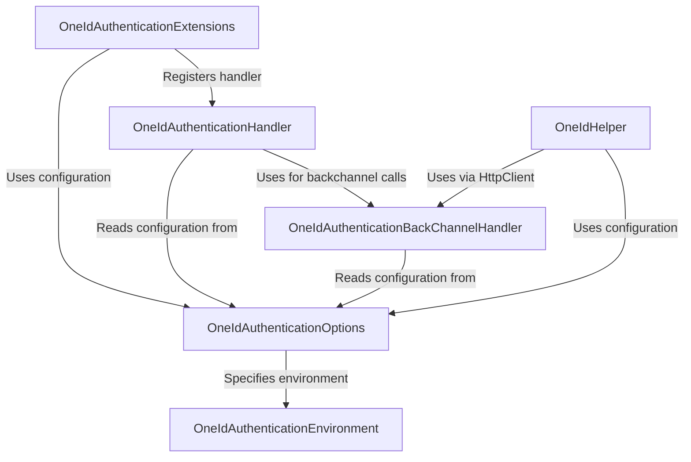

# Tutorial: oneid-oauth-middleware

This project provides middleware for ASP.NET web applications to easily implement **secure login** using Ontario Health's *OneID service*.
It handles the complex **OAuth 2.0 and OpenID Connect** flows, allowing developers to add OneID authentication with minimal setup.
Key features include configuring application details, managing the login redirect, handling callbacks, validating tokens, and providing helper functions for logout and token refresh.

**Source Repository:** [https://github.com/Clinical-Support-Systems/oneid-oauth-middleware](https://github.com/Clinical-Support-Systems/oneid-oauth-middleware)

## Chapters

1. [OneIdAuthenticationOptions
](01_oneidauthenticationoptions_.md)
2. [OneIdAuthenticationEnvironment
](02_oneidauthenticationenvironment_.md)
3. [OneIdAuthenticationExtensions
](03_oneidauthenticationextensions_.md)
4. [OneIdAuthenticationHandler
](04_oneidauthenticationhandler_.md)
5. [OneIdAuthenticationBackChannelHandler
](05_oneidauthenticationbackchannelhandler_.md)
6. [OneIdHelper
](06_oneidhelper_.md)

---

Generated by [AI Codebase Knowledge Builder](https://github.com/The-Pocket/Tutorial-Codebase-Knowledge)